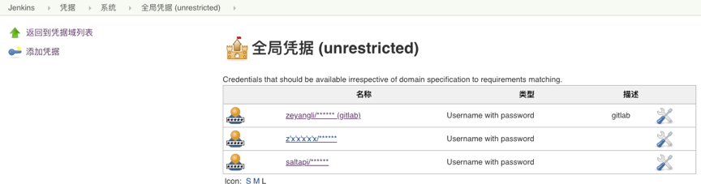
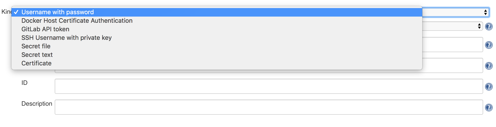
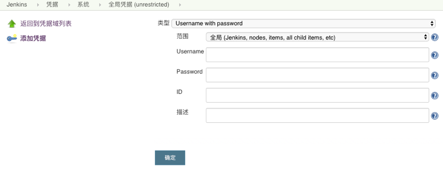
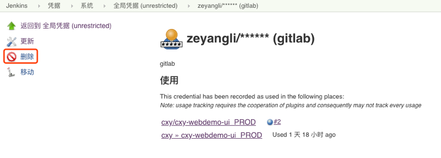
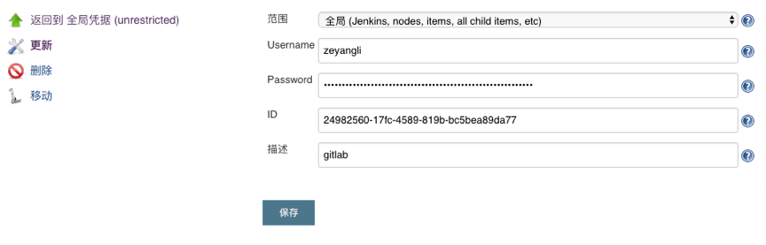
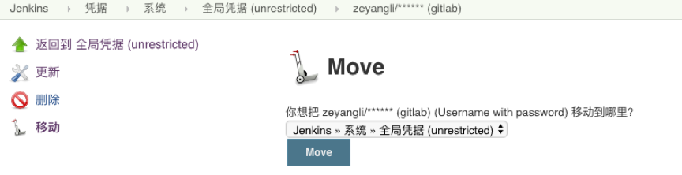
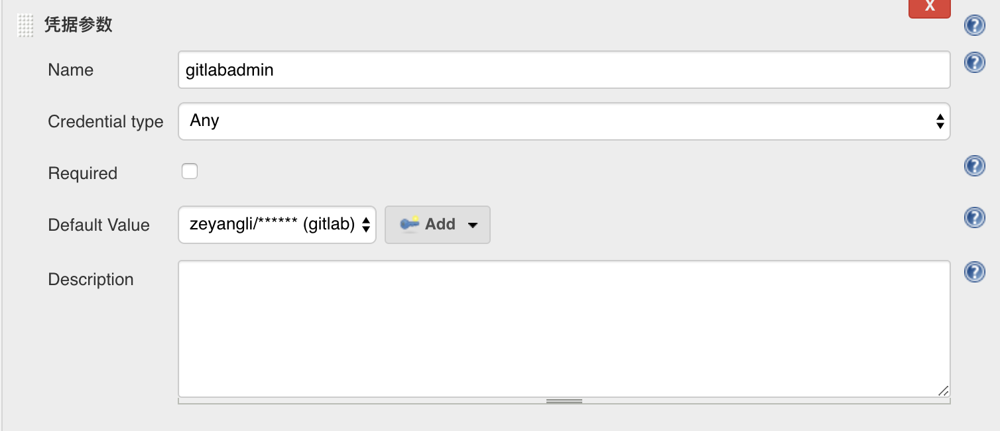
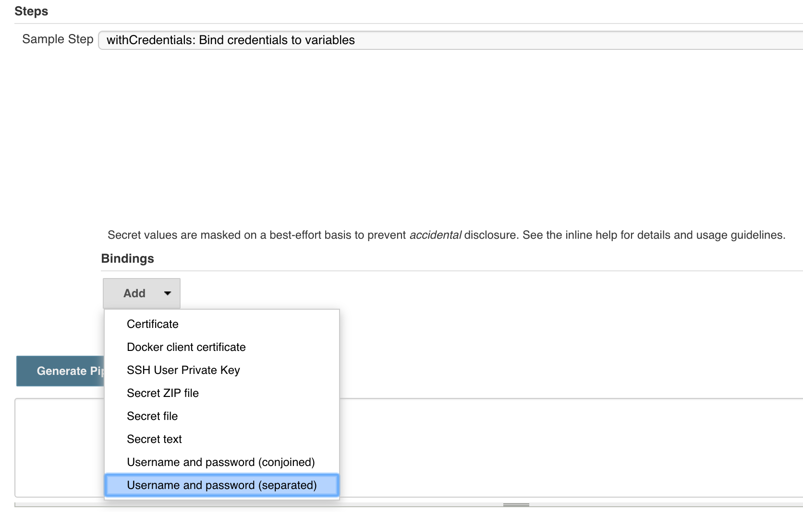
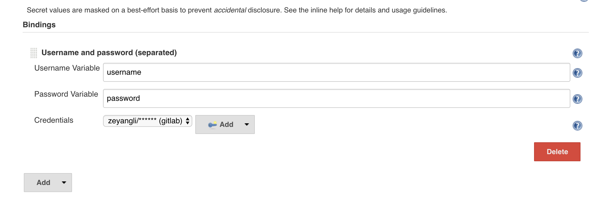

您好，本章我们将指导大家如何管理Jenkins的凭据 😀 每个凭据会有一个唯一的ID，这个ID很重要，可以自定义也可以随机生成。（后续流水线中引用都是通过ID引用的）


### 目录
+ [新建凭据](#新建凭据)
+ [删除凭据](#删除凭据)
+ [更新凭据](#更新凭据)
+ [移动凭据](#移动凭据)
+ [使用凭据](#使用凭据)

---
Jenkins的凭据有很多种类型，可以将一些敏感信息存储为凭据，然后在项目中引用。
凭据-> 系统-> 全局凭据




* `Username with password`类型存储Harbor或者其他系统的用户名和密码。
* `GitLab API token`类型存储Gitlab的用户API token。
* `Secret text`类型可以用来存储OpenShift等系统中的token。
* `Certificate`类型可以用户存储证书，例如k8s的用户证书。


### 新建凭据
选择需要创建的凭据的类型，然后输入账号和密码等信息。保存即可。



### 删除凭据
当一些凭据已经不需要的时候，可以进行删除。


### 更新凭据
当用户名或者密码更改后，可以选择凭据进行修改。


### 移动凭据

目前移动凭据很少用，当存在多个阈的时候可以使用。




### 使用凭据

我们可以在项目中增加一个凭据参数，用与项目构建中使用。


当我们使用pipeline类型的项目的时候，我们可以通过`片段生成器`生成流水线语法

* 选择要使用的凭据的类型


* 输入该凭据的账号的密码的变量名称（后续直接在流水线中使用此变量进行引用）


* 流水线代码

```
withCredentials([usernamePassword(credentialsId: '24982560-17fc-4589-819b-bc5bea89da77', passwordVariable: 'password', usernameVariable: 'username')]) {
    // some block

    sh "curl -u ${username}:${password} xxxxxxxxx"
}
```

---