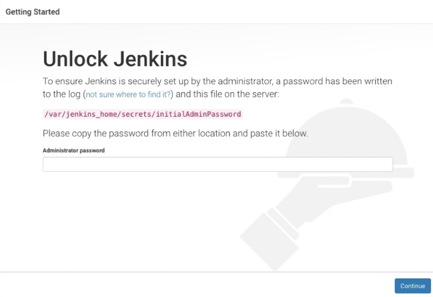
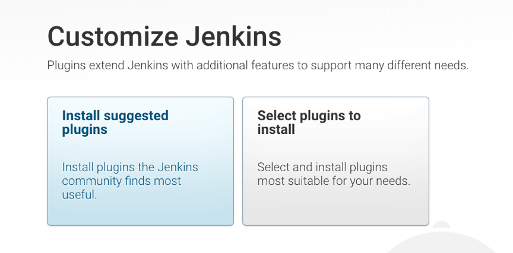
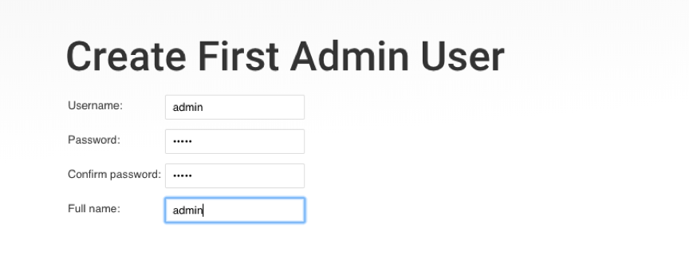
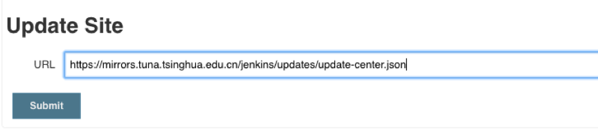
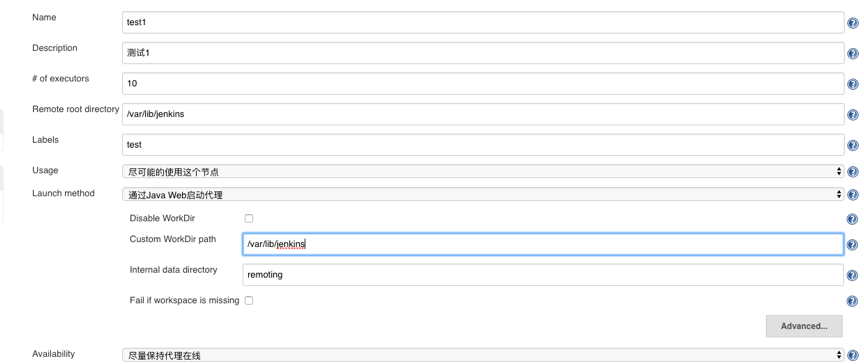
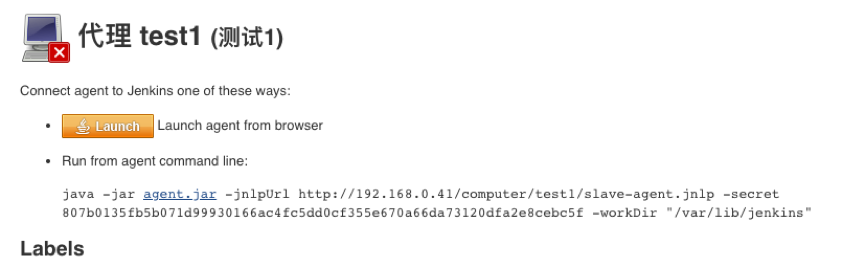
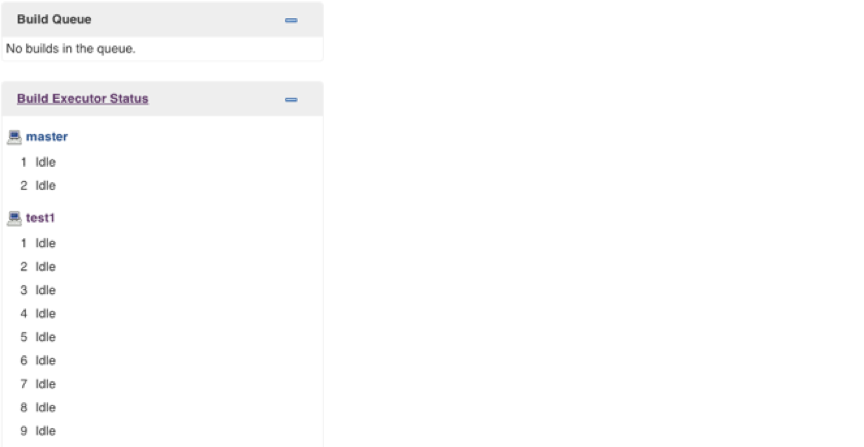
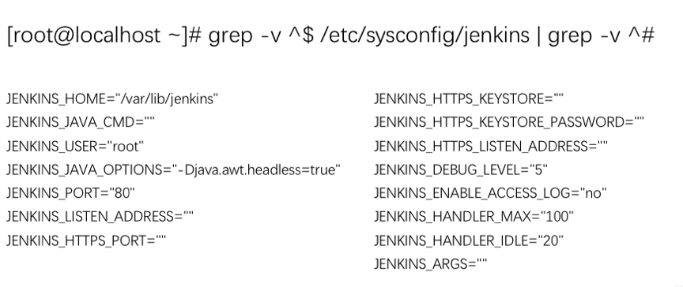

您好，本章我们将指导大家如何安装Jenkins，很简单，让我们一起来安装吧！ 😀


### 目录

+ [先决条件](#先决条件)
  - [软件要求](#软件要求)
  - [硬件要求](#硬件要求)

+ [软件包下载](#软件包下载)
  - [war包部署](#war包部署)
  - [linux系统部署](#linux系统部署)
  - [mac系统部署](#mac系统部署)
  - [windows系统部署](#windows系统部署)

+ [安装后基本配置](#安装后基本配置)
  - [解锁](#解锁)
  - [自定义jenkins插件](#自定义jenkins插件)
  - [创建用户](#创建用户)
  - [配置更新站点](#配置更新站点)
  - [安装slave节点](#安装slave节点)
  - [jenkins配置文件](#jenkins配置文件)

---

### 先决条件

#### 软件要求
* Java8 无论是Java运行时环境（JRE）还是Java开发工具包（JDK）都可以。

#### 硬件要求
* 最低配置： 256MB可用内存，1GB可用磁盘空间（Docker推荐10GB）。
* 小团队配置： 1GB+可用内存， 50GB+可用磁盘空间。

### 软件包下载
* [最新war包](https://mirrors.tuna.tsinghua.edu.cn/jenkins/war-stable/)
* [最新pkg包](http://mirrors.jenkins.io/osx/latest)
* [最新exe包](http://mirrors.jenkins.io/windows/latest)
* [最新rpm包](https://mirrors.tuna.tsinghua.edu.cn/jenkins/redhat-stable/)

#### war包部署
Jenkins的web应用程序archive（war）包是可以在任何支持Java的操作系统上运行。

* 将下载的war包放到jenkins的目录中（可以自定义)。
* 运行命令 `java -jar jenkins.war`启动。
* 此时可以看到Jenkins的启动日志，查看是否有异常。
* 通过浏览器访问`http://localhost:8080`。

{}
注意：可以通过 –httpPort方式指定端口， `java -jar jenkins.war -httpPort=9090。`
{}


#### linux系统部署

* 首先下载rpm软件包,安装`rpm –ivh jenkins-2.150.3-1.1.noarch.rpm` 
* `systemctl start jenkins` #启动服务
* `systemctl enable jenkins` #开机自启

#### mac系统部署
下载软件包手动安装

* `brew install jenkins` 安装jenkins最新版本
* `brew install jenkins-lts`  安装jenkinsLTS版本


#### windows系统部署
下载软件包通过向导安装即可。


### 安装后基本配置

#### 解锁

当您第一次访问Jenkins的时候，系统会要求您使用自动生成的密码对其进行解锁。解锁秘钥可以通过$JENKINS_HOME/secrets/initialAdminPassword文件获取。还可以通过在启动日志中获取。




#### 自定义jenkins插件

* 解锁Jenkins之后再自定义Jenkins页面，您可以安装任何数量的插件作为初始化的一部分。
* 分别是安装建议的插件和选择要安装的插件（如果不确定要安装那些的时候可以选择此选项，灵活的自定义安装）。
* 插件安装多了也没关系，可以后面再jenkins插件管理页面删除哦(会很繁琐)。



#### 创建用户
在这里创建一个管理员账号，到此jenkins的初始化配置已完成。


#### 配置更新站点


当改完后，其实还是很慢 🤷‍♀️ 建议配置nginx做域名代理 😜

由于使用官方的站点速度相对很慢，这里采用[清华大学的jenkins更新站点](https://mirrors.tuna.tsinghua.edu.cn/jenkins/updates/update-center.json)。




#### 安装slave节点


 😜 注意需要开启jnlp协议才能使用java web启动，具体操作： 系统设置-> 全局安全 -> 代理配置

系统管理->节点管理



创建完成后会出现slave节点启动的命令，下载agent.jar，然后启动服务。



启动命令

```shell
wget http://192.168.0.41/jnlpJars/agent.jar
java -jar agent.jar -jnlpUrl http://192.168.0.41/computer/test1/slave-agent.jnlp -secret 807b0135fb5b071d99930166ac4fc5dd0cf355e670a66da73120dfa2e8cebc5f -workDir "/var/lib/jenkins"
```

启动成功



#### jenkins配置文件
以rpm方式部署的配置文件在/etc/sysconfig/jenkins，可以定义Jenkins启动参数和端口。




---


