您好，本章我们将指导大家Jenkins中的项目类型，通过视图对项目进行管理 😀 创建一个项目很简单，如何管理大规模下的项目呢？ -建立合适的命名规范。

### 目录
+ [项目管理](#项目管理)
  - [新建项目](#新建项目)
  - [删除禁用项目](#删除禁用项目)
  - [项目分类](#项目分类)

+ [视图管理](#视图管理)
  - [创建视图](#创建视图)
  - [删除视图](#删除视图)
  - [更新视图](#更新视图)

---

### 项目管理

管理项目的前提是，具有合理的命名规范。 命名规范: 业务名称-应用名称-应用类型_环境类型： cxy-wlck-ui_TEST, 有命名规范后会更加方便管理项目。

#### 新建项目

新建一个项目，项目的类型有很多，例如自由风格的项目、maven类型项目等。这里我们主要用的是流水线pipeline类型的项目。

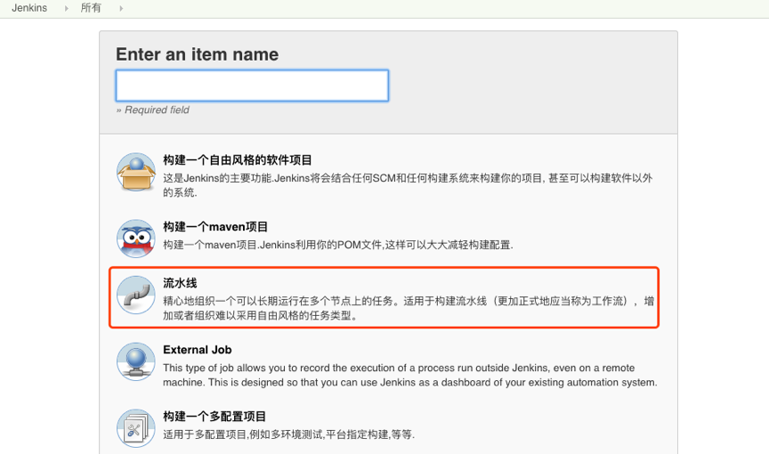

设置构建历史：构建历史要有合理的策略，过多历史数据会导致jenkins磁盘空间增大。例如：保留30天内的近20次构建记录。

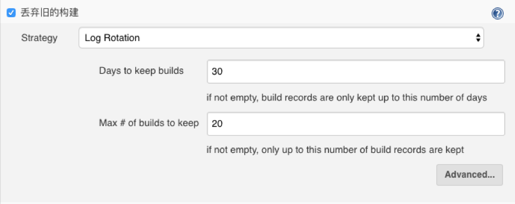

选择参数化构建： 参数化构建就是将项目的信息变成编程语言中的变量，便于后期流水线运行时引用。

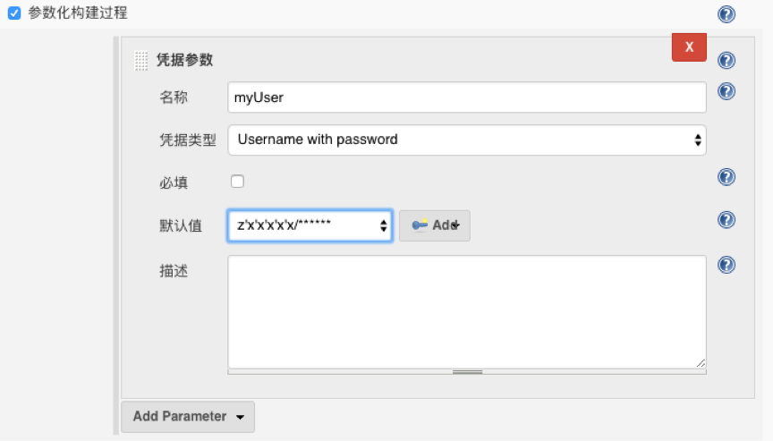

设置Jenkinsfile：
Jenkinsfile如同dockerfile，在docker中使用dockerfile创建出一个镜像，在jenkins中使用jenkinsfile定义项目流水线的运行步骤和运行相关配置。Jenkinsfile可以直接写在项目中，也可以通过scm版本控制系统进行管理。选择后种方式便于回退，更加友好。

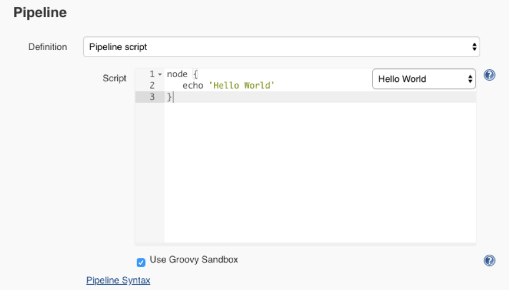

构建项目： 很简单，直接点击构建就好了。当然触发构建的方式后很多，见后续扩展内容。
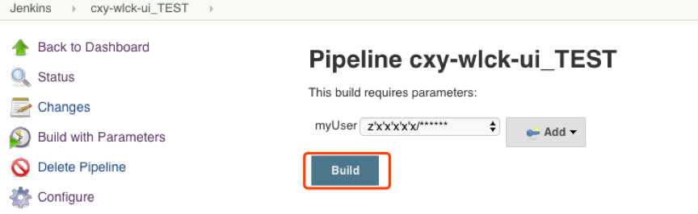

查看构建日志： 构建日志是一条流水线项目的运行步骤信息，例如构建的错误信息等。便于排错。
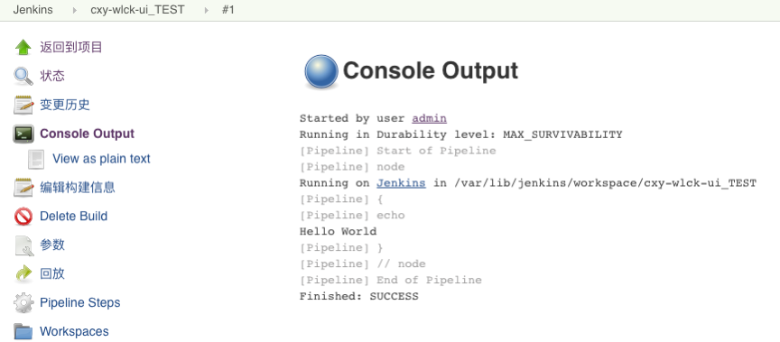

调试Pipeline：当流水线出问题的时候，可以不直接修改源文件，而是通过流水线的回放功能进行编辑调试运行。很有用的功能，便于调试。

#### 删除禁用项目
当项目不需要的时候可以进行先禁用再删除。
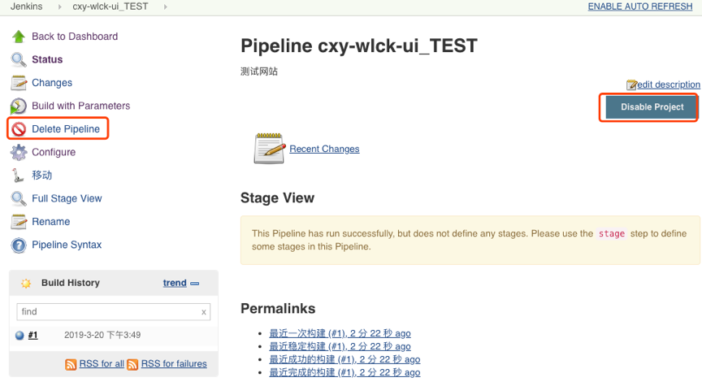

#### 项目分类
当项目很多时候可以按照项目或者业务建立文件夹，将同业务的项目移动到文件夹中。
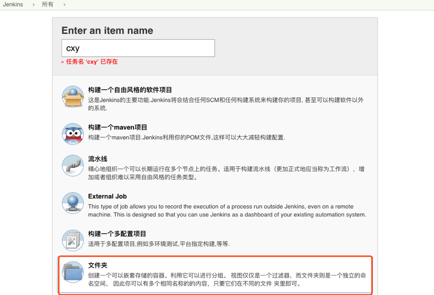

移动项目
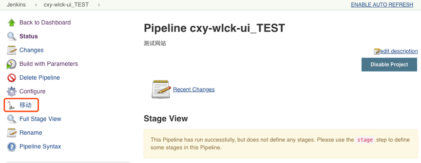

---

### 视图管理
默认Jenkins会自动创建一个all视图，里面存放所有的项目。

#### 创建视图
点击加号新建视图 
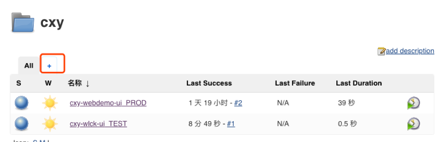

填写视图的名称，选择列表视图
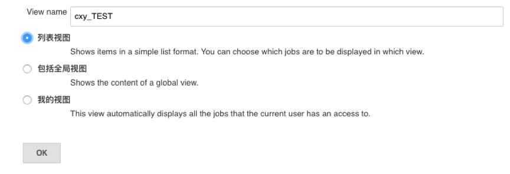

选择视图包含的项目。这里使用正则表达式的方式，当然也可以直接手动选择。
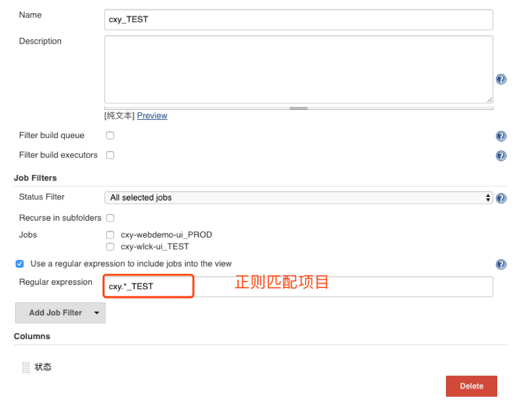

创建完成
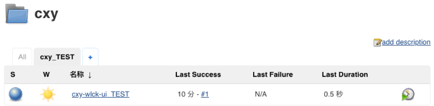

#### 删除视图

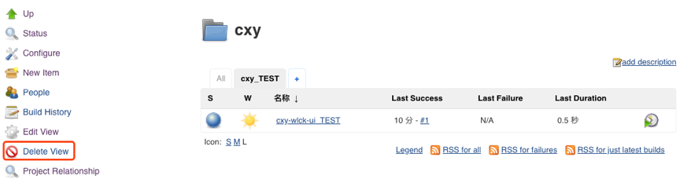

#### 更新视图
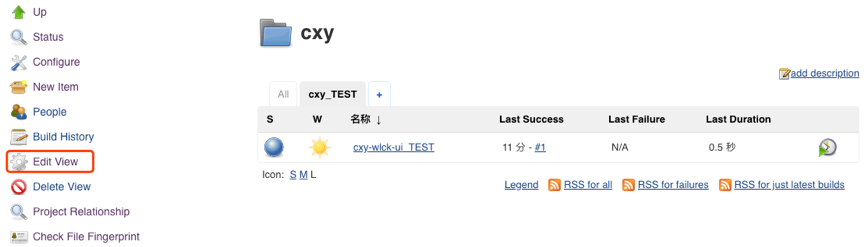

---

