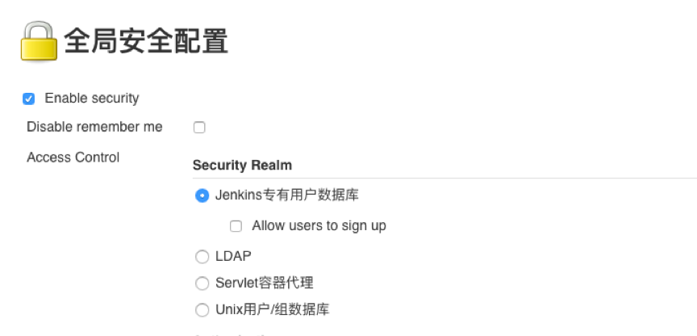
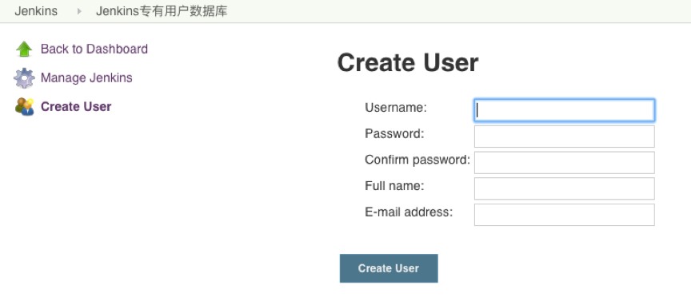
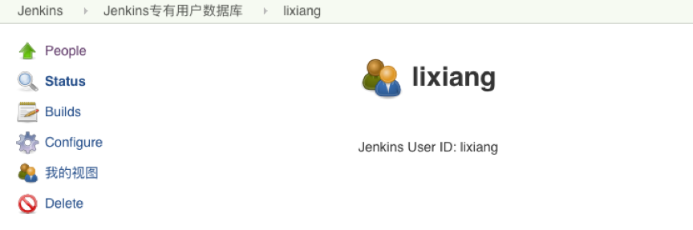
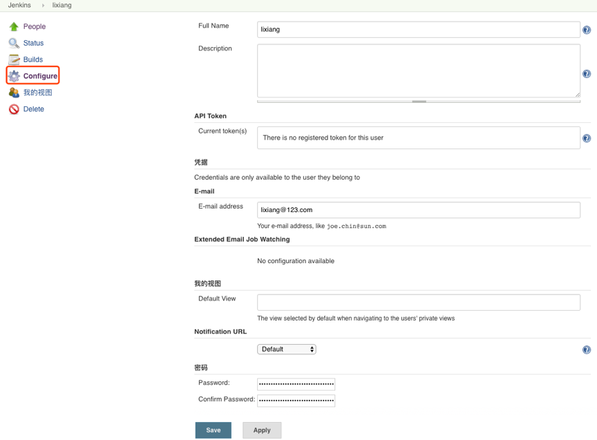
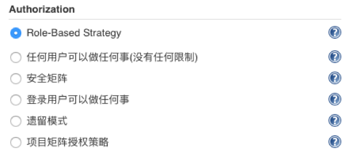
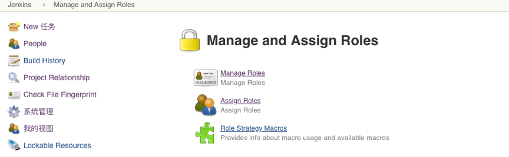
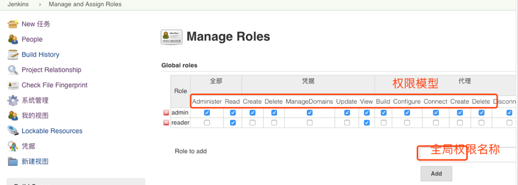
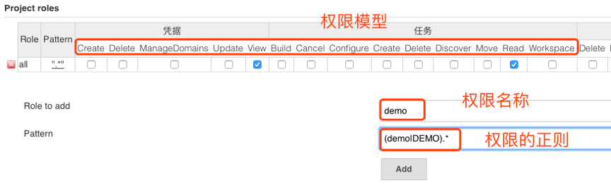
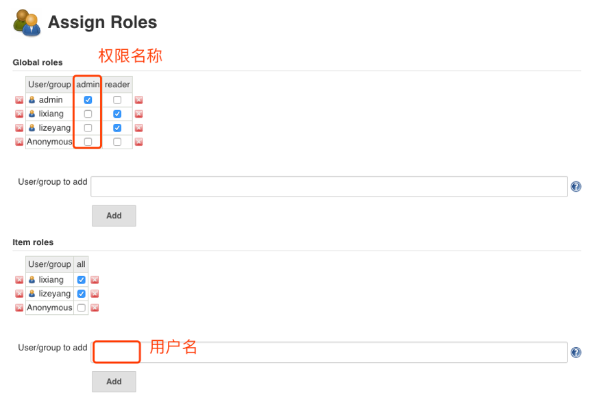

您好，本章我们将指导大家在Jenkins中如何管理用户及用户权限 😀

### 目录
+ [用户管理](#用户管理)
  - [查看用户](#查看用户)
  - [新建用户](#新建用户)
  - [删除用户](#删除用户)
  - [更新用户](#更新用户)

+ [权限管理](#权限管理)
  - [管理权限](#管理权限)
  - [全局权限](#全局权限)
  - [项目权限](#项目权限)
  - [权限授权](#权限授权)

---

Jenkins默认使用的是自带的数据库管理用户，支持同步LDAP、Github等认证集成。关于用户与权限管理是Jenkins比较弱的一点，当大规模授权的时候建议使用API接口授权，否则当你打开web页面授权时，会很乱加载缓慢，最终导致保存失败权限丢失。 

### 用户管理
* 配置用户接入入口: 系统管理->全局安全配置。
* 默认使用的是Jenkins数据库存储。
* 可以选择集成LDAP服务或者是GItlab服务（需要安装插件后才能使用，后面会讲解）。

#### 查看用户
以使用Jenkins专有数据库为例，用户管理入口: 系统管理-> 管理用户

#### 新建用户

#### 删除用户

#### 更新用户

---

### 权限管理

> 注意安装插件: 权限默认使用 Role-Based Strategy,其他方式如图所示。

#### 管理权限

- 系统设置->Manage and Assign Roles->Manage Roles
- Global roles：添加用户和用户组，分配某个用户属于哪个用户组。
- Project roles：添加某个工程或某一组工程的用户或用户组
- Slave roles：添加某个节点或某一组节点的用户或用户组

#### 全局权限

#### 项目权限

#### 权限授权

