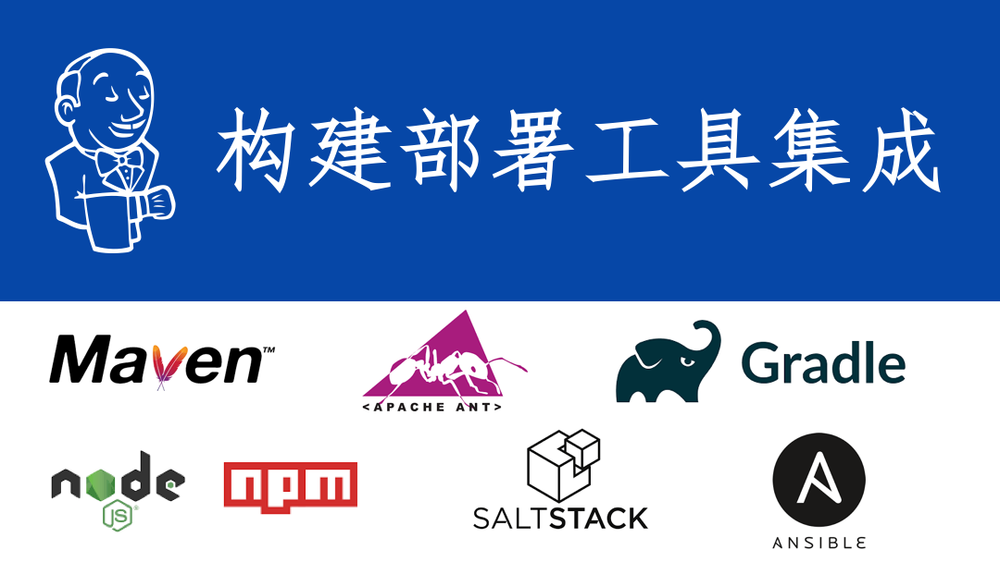

{}
您好，本章主要讲解与构建工具和发布部署工具的集成！例如： Maven、Ant、Gradle、Npm、Saltstack、Ansible 😀
{}



### 目录

+ [构建工具安装](#构建工具安装)
  - [软件包下载](#软件包下载)
  - [配置环境](#配置环境)
+ [构建工具集成](#构建工具集成)
  - [通过Jenkins配置](#通过Jenkins配置)
  - [通过Jenkinsfile配置](#通过Jenkinsfile配置)
+ [发布工具安装](#发布工具安装)
  - [安装saltstck](#安装saltstck)
  - [安装ansible](#安装ansible)
+ [发布工具集成](#发布工具集成)

---

### 构建工具安装

{}
构建工具是安装到`master`还是`node`节点呢？ 很显然安装在master节点并不友好，一般我们不会让master节点执行构建任务的，我们都是使用node节点完成构建任务。所以我们要部署在node节点中哦。（当然我只是做实验所以部署到了master节点，生产环境不要这么做哦！）
{}

这些构建工具的安装很简单的，只需要在每个构建工具的官网找到软件包，然后下载到本地解压并配置环境变量就好了。接下来我们实践一下！

#### 软件包下载
* [maven软件包下载](http://maven.apache.org/download.cgi)
* [gradle软件包下载](https://downloads.gradle.org/distributions/gradle-5.3-bin.zip)
* [ant软件包下载](https://ant.apache.org/bindownload.cgi)
* [node软件包下载](https://nodejs.org/en/download/)

#### 配置环境

```bash
#解压
tar zxf apache-maven-xxxx.tar.gz  -C /usr/local
tar zxf gradle-xxxx.tar.gz -C /usr/local
tar zxf node-xxxxx.tar.gz -C /usr/local
tar zxf apache-ant-xxxx.tar.gz -C /usr/local

#添加环境变量
vim /etc/profile
export MAVEN_HOME=/usr/local/apache-maven-3.6.0
export ANT_HOME=/usr/local/apache-ant-1.10.5
export GRADLE_HOME=/usr/local/gradle-5.3
export NODE_HOME=/usr/local/node-v10.15.3-linux-x64
export JAVA_HOME=/usr/local/jdk1.8.0_201
export PATH=$PATH:$MAVEN_HOME/bin:$ANT_HOME/bin:$GRADLE_HOME/bin:$NODE_HOME/bin
export PATH=$PATH:$JAVA_HOME/bin

# 生效全局环境变量
source /etc/profile   
```


### 构建工具集成
在这里需要强调一下，Jenkins调用这些工具的方式是通过环境变量调用。有两种方式 一种是在Jenkins系统配置中添加构建工具的环境变量，一种是直接在Jenkinsfile中定义。实现的效果没有区别，而后者更加灵活对于配置Jenkins无状态化有好处。


#### 通过Jenkins配置

{}
我们打开系统管理-> `全局工具配置`页面，这里就是配置我们在运行流水线过程中使用的构建工具的地方。如果没有找到`maven`需要安装插件`Maven Integration`才能有哦。
{}

在这里我们通过变量名和变量值的方式定义好构建工具，变量名称不能冲突，可以大小写。关于变量的值保守点可以定义成MAVE_HOME`/usr/local/apache-maven-3.6.0/`，也可以写成绝对路径`/usr/local/apache-maven-3.6.0/bin/mvn`。 定义好工具之后我们如何在Jenkinsfile中使用工具呢？


在Jenkinsfile中使用: 如上图所示，我定义的maven变量名称为`M3`,接下来在Jenkinsfile中使用`tool`获取变量值。如下：

```
stage("mavenBuild"){
    steps{
        script{
            def mvnHome = tool 'M3'
            sh "${mvnHome}/bin/mvn  clean package "
        }
    }
}
```


#### 通过Jenkinsfile配置
在Jenkinsfile中定义其实跟我们在上面的系统中定义是一样的，我们只需要将变量名和值直接定义在文件中。然后直接调用。

```
stage("mavenBuild"){
    steps{
        script{
            def mvnHome = '/usr/local/apache-maven-3.6.0'
            sh "${mvnHome}/bin/mvn  clean package "
        }
    }
}
```

现在你是否清楚了关于构建工具的集成呢？类似的例如您当前用的构建工具不在我的举例范围内，相信你通过这篇文章也知道了如何来进行集成了。对的没错：在系统中安装好构建工具，在jenkinsfile中定义好环境变量即可。特殊工具特殊对待哦！


### 发布工具安装
关于发布工具我们常用的是`saltstack`和`ansible`这个两个工具，这里简单说下如何集成。


#### 安装saltstck
saltstack也是C/S架构，需要在应用服务器安装salt-minion客户端。

yum源：https://mirrors.tuna.tsinghua.edu.cn/saltstack/#rhel

```bash
#install
yum –y install salt-master salt-minion

#start
service salt-master start
service salt-minion start 

#enable
chkconfig salt-master on
chkconfig salt-minion on 
```
---


#### 安装ansible
ansible不需要安装客户端，是通过SSH协议通信的。使用`/etc/ansible/hosts`文件控制主机。

```
yum install epel-release ansbile
service ansible start 
```


### 发布工具集成

```
stage("SlatDeploy"){
    steps{
        script{
            
            //saltstack
            sh " salt ${host} test.ping "

            //ansible
            sh " ansible -m ping ${host} "
        }
    }
}
```

关于发布工具暂且就这些了，有关发布工具的详细内容还需要各位自行在官方阅读哦。saltstack有API服务可以在jenkinsfile中封装HTTP API。

---

