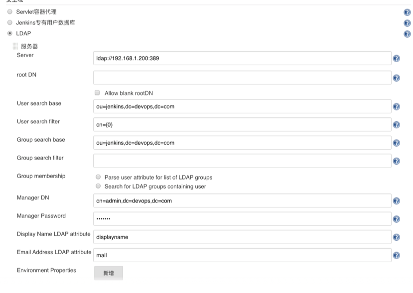
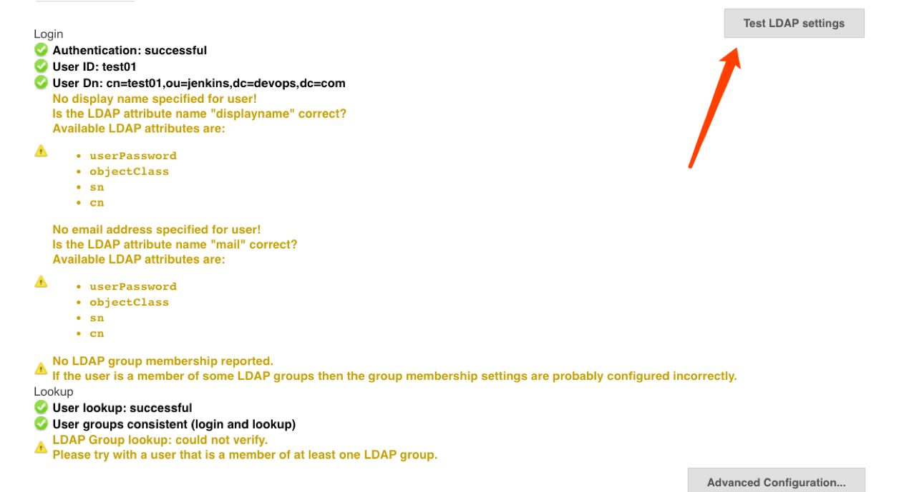
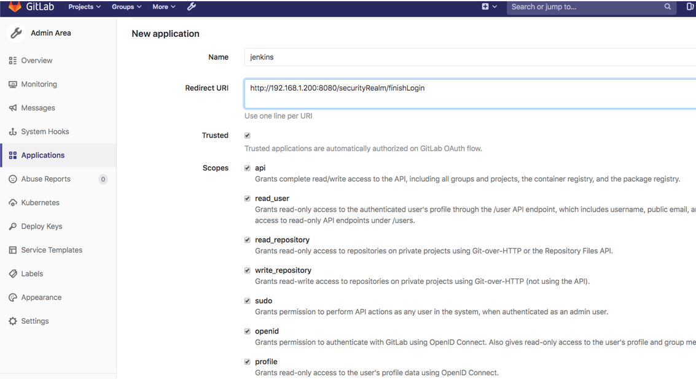
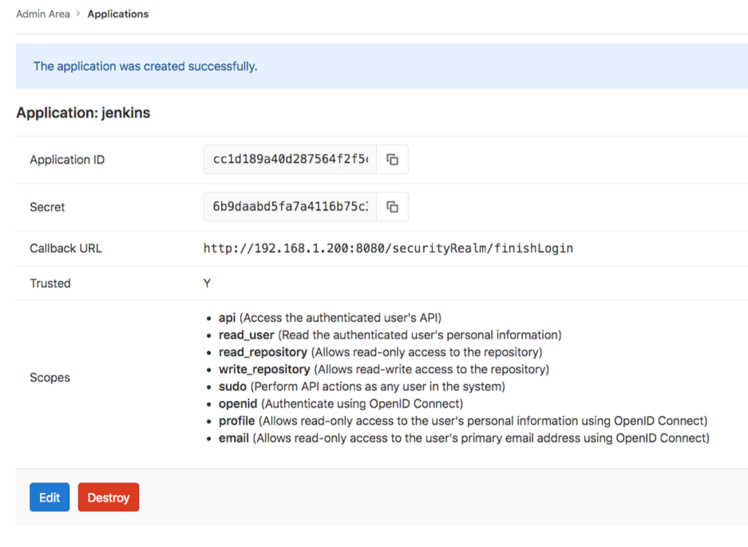
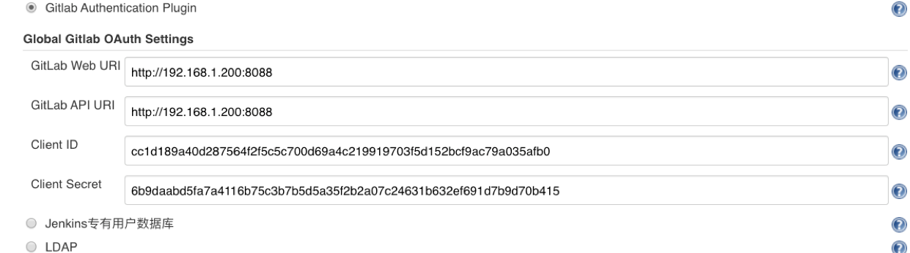
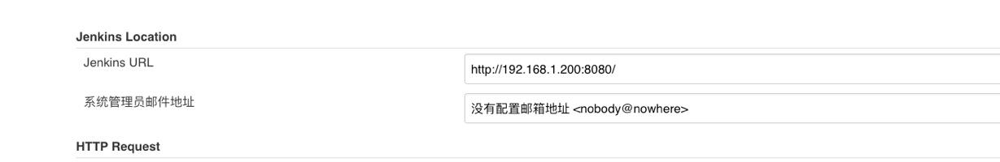
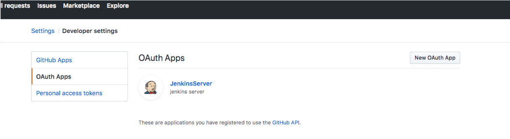
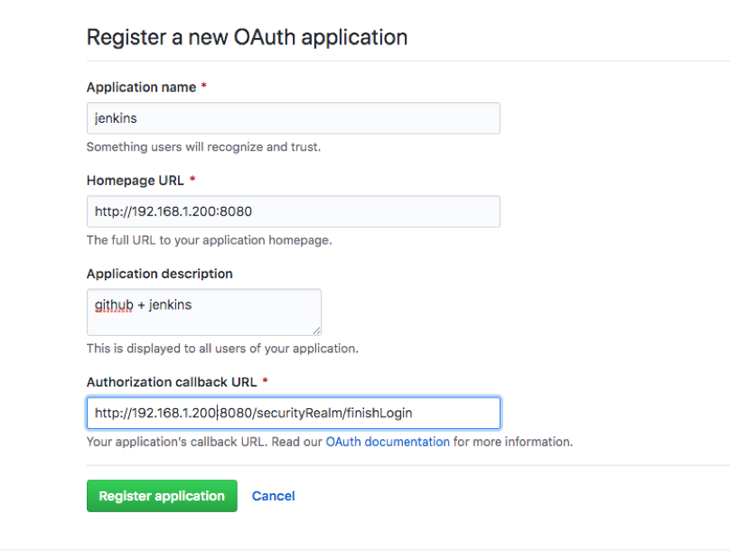
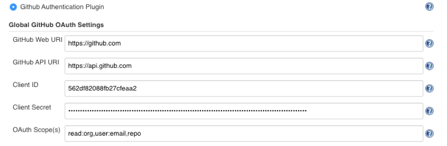

{}
您好，本章主要讲解与jenkins与用户认证系统集成 例如：LDAP Gitlab GitHub 。我们做实验的过程中建议先开启匿名模式，防止配置错误导致无法直接登录。 😀
{}

### 目录

+ [ldap系统集成](#ldap系统集成)
+ [gitlab单点登录](#gitlab单点登录)
  - [gitlab配置](#gitlab配置)
  - [jenkins配置](#jenkins配置)
+ [github单点登录](#github单点登录)
  - [github配置](#github配置)
  - [配置jenkins](#配置jenkins)

---

Jenkins默认使用自带数据库模式存储用户，在企业中一般都会有统一的认证中心，例如 LDAP、ActiveDirectory中管理用户。可以配置Jenkins集成实现统一用户管理。

### ldap系统集成

LDAP系统是用于用户管理，在配置集成的时候我们只需要以下信息：

* 服务器地址： ldap://192.168.1.200
* 服务器端口: 389
* 组织OU: ou=jenkins,dc=devops,dc=com
* 管理员账号和密码: cn=admin,dc=devops,dc=com

首先，我需要在Jenkins系统中安装`LDAP`插件，然后进入 系统管理 -> `全局安全配置`页面中。

填写好信息之后，我们可以点击测试按钮进行测试。会模拟用户登录，成功后再保存配置即可。

### gitlab单点登录
一般我们会配置Gitlab系统与LDAP系统做用户认证集成，开发人员登录gitlab系统的频率还是很多的，今天我们的配置效果是：当用户已经登录了gitlab，再次打开Jenkins会自动登入。

#### gitlab配置
首先，我们需要在Gitlab中添加一个应用。系统设置 -> 应用管理

填写Jenkins回调地址`http://jenkinsserver:8080/securityRealm/finishLogin`,勾选权限默认具有`read_user`权限即可。

保存配置，会提示以下信息，这些信息需要填写到Jenkins中。`ApplicationId` `secret`

#### jenkins配置

我们需要在Jenkins系统中安装插件`Gitlab Authentication`， 然后导航到`全局安全配置`。
填写Gitlab系统地址和上面在Gitlab创建的应用的`ApplicationId` `secret`。

{}
注意：当Jenkins前面有代理的时候可能会出现跳转错误的问题。这时候需要看下提示错误的redirect URL地址,检查下图配置。 如果下图配置没有问题，请检查代理的配置问题。另外要注意是`http`模式哦
{}

### github单点登录
如果你用过GitLab，你会发现与GitHub很类似。这里我们要配置的GitHub集成与GitLab配置很类似。

#### github配置
首先登录GitHub, settings -> Developer Settings -> Oauth Apps。 

新建应用：填写Jenkins回调地址`http://jenkinsserver:8080/securityRealm/finishLogin`。

保存，获取应用ID和secret

#### 配置jenkins
我们需要在Jenkins系统中安装插件`Github Authentication`， 然后导航到`全局安全配置`。
填写Gitlab系统地址和上面在Gitlab创建的应用的`ApplicationId` `secret`。

效果：

---

