{}
您好，本章主要我们主要学习与版本控制系统Gitlab的集成，例如：配置提交流水线和合并流水线。
{}


### 目录

+ [提交流水线](#提交流水线)
  - [配置jenkins](#配置jenkins)
  - [配置gitlab](#配置gitlab)
+ [提交流水线优化](#提交流水线优化) 
  - [分支名称自动替换](#分支名称自动替换)
  - [增加构建描述信息](#增加构建描述信息)
  - [变更commit状态](#变更commit状态)
  - [构建失败邮件通知](#构建失败邮件通知)
  - [过滤特殊push请求](#过滤特殊push请求)
+ [合并流水线](#合并流水线)

---

### 提交流水线
当Gitlab中触发push操作，则触发相对应的Jenkins流水线构建。实现快速反馈与验证。

* 方式1： 使用Gitlab CI,当有push请求，在CI脚本中远程触发Jenkins项目构建。
  - 需要准备Gitlab runner 
  - 编写触发Jenkins脚本
* 方式2： 使用Gitlab WebHook,当有push请求，直接触发jenkins项目构建。【采用】
  - 需要配置Gitlab webHook
  - 需要配置Jenkins项目Hook

#### 配置jenkins

首先我们准备一个能够构建成功的流水线项目（暂且不设置复杂的步骤，helloworld即可）
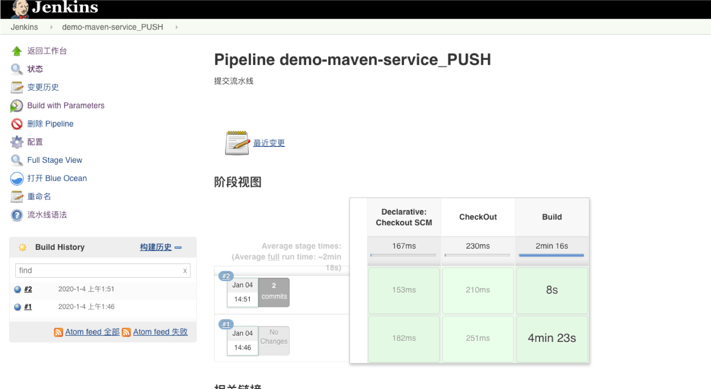

编辑项目配置: 我们要使用`Generic Webhook Trigger`触发器，需要安装插件。这触发器非常灵活，推荐使用。

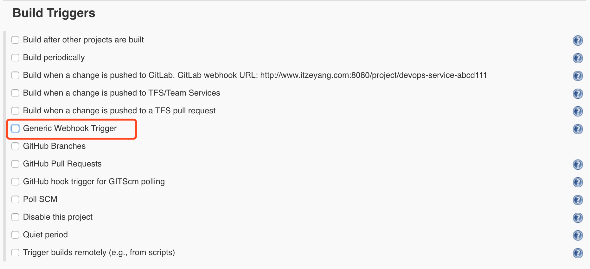

开启`Generic Webhook Trigger`触发器，添加一个请求参数runOpts `Request parameters` 。我们定义这个参数是为了对构建做个标识。辨别手动触发构建与提交构建。配置一个`token`默认我使用的是项目的名称，必须唯一，否则在配置了相同的token的项目都会被触发。`Print post content`用于展示请求日志,`Print contributed variables`展示我们在post中获取的变量内容。

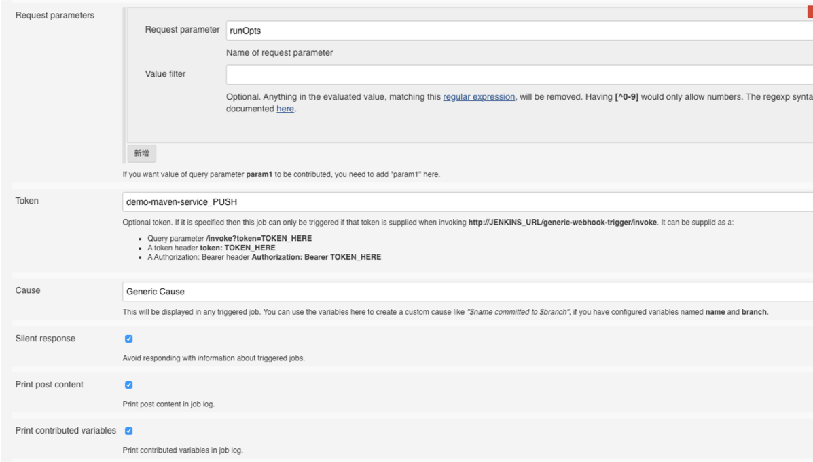

配置完成后： 我们生成一个触发URL

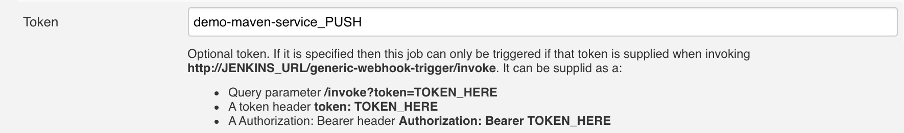
`http://JENKINS_URL/generic-webhook-trigger/invoke?token=demo-maven-service_PUSH&runOpts=GitlabCI`


#### 配置gitlab
我们找到要配置提交触发构建的项目,设置->集成,勾选`Push Events`
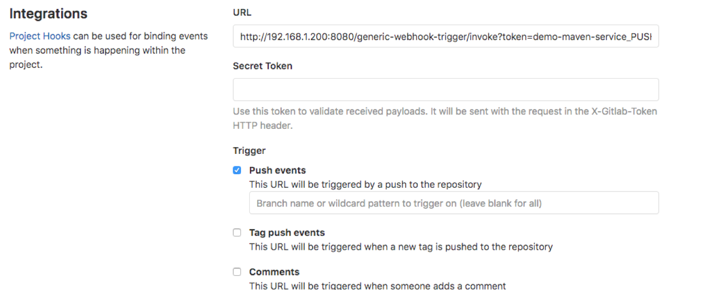

{}
配置完成，这时候我们进行提交代码，会发现已经能够正常触发项目构建了。如果出现了问题，我们重点检查jenkins的项目触发URL和网络权限问题。
{}


### 提交流水线优化

#### 分支名称自动替换
当我们在任意分支提交的时候，Jenkins需要获取我们提交的分支进行构建。而不是固定的分支。

增加获取hook参数 分支名称变量 `Post content parameters`. `$`指的是在Gitlab系统中`push`操作触发后发送给Jenkins的数据。（这个数据包含谁提交的、提交的分支、提交的id等信息）。而`$.ref`是解析这个json格式的数据，获取其中的`ref`也就是提交的分支名称。
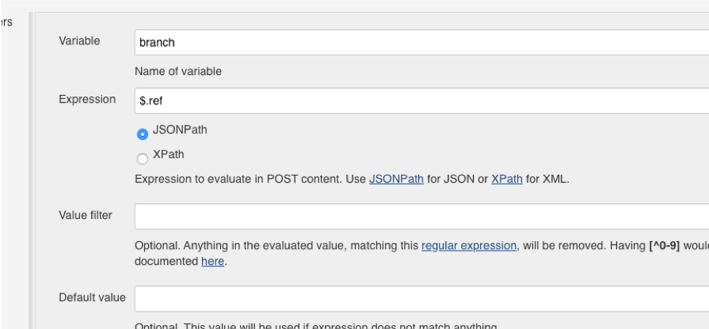

查看下面这段jenkinsfile,你会发现`branch`变量就是上面我们在触发器中配置的，它的原始内容是`refs/heads/master`，因为我们在下载代码的时候不需要前面`refs/heads/`内容，所以去掉了。此时可以重复在不通的分支提交代码，当在构建日志中出现了不通的分支名称，则成功了。

```
branchName = branch - "refs/heads/"

//pipeline
pipeline{
    agent { node { label "build"}}
    stages{

        stage("CheckOut"){
            steps{
                script{
                    println("${branchName}")
                }
            }
        }
    }
}
```

#### 增加构建描述信息
别忘了我们在前面构建触发器中配置了`runOpts`参数，这个参数我们用于区分不通的构建触发方式（手动、提交触发）。 这时候我们可以结合`currendBuild.description`配置。

为了更加明显我们可以在触发器中再添加一个参数，用户获取提交的用户。

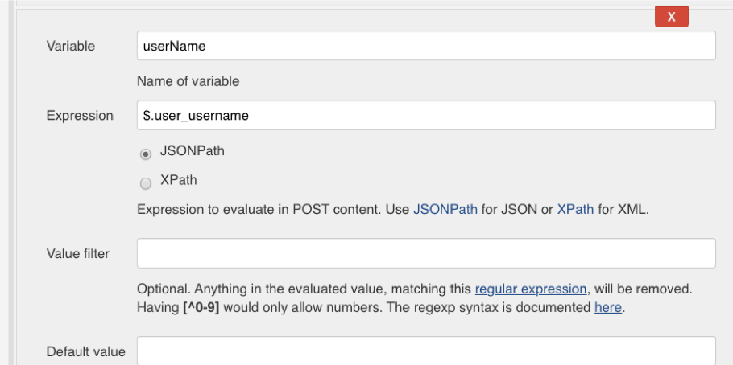

然后我们来完善一下上面的Jenkinsfile，如下：

```
branchName = branch - "refs/heads/"
currentBuild.description = "Trigger by ${userName} ${branch}"

//pipeline
pipeline{
    agent { node { label "build"}}
    stages{

        stage("CheckOut"){
            steps{
                script{
                    println("${branchName}")
                }
            }
        }
    }
}
```

改好了之后，我们可以进行调试了。当你在项目的构建记录中看到下图信息，表名成功了。

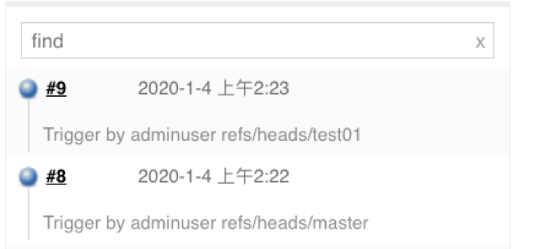


#### 变更commit状态
其实，Gitlab自身的GitlabCI很好用，能够根据流水线的状态设置当前提交的状态。而我们使用Jenkins也是可以完成这样的配置。这个需要我们去研究Gitlab的API。先看下效果吧！
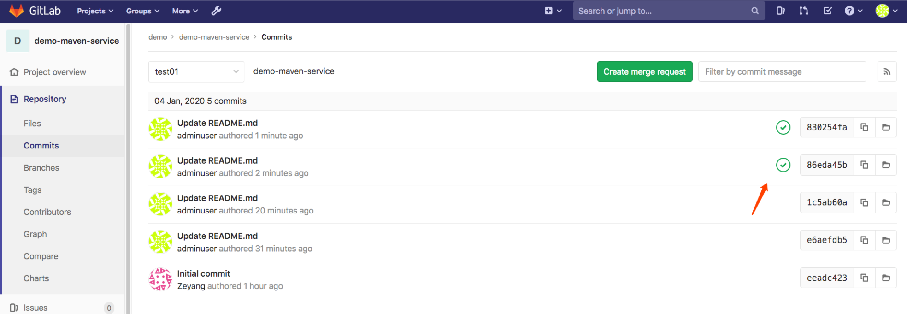

开始配置： 需要研究[Gitlab的Pipeline接口文档](https://docs.gitlab.com/ee/api/commits.html#post-the-build-status-to-a-commit) 关于gitlab中pipeline的状态有：[pending, running, success, failed, canceled] 。 接口地址为`projects/${projectId}/statuses/${commitSha}?state=state`。

搞清楚了上面这些，我们在共享库中进行封装就很简单了。 开始吧！可以看到我们还需要一些信息例如：`projectId`gitlab项目的ID,`commitSha`提交的id。我们该如何获取呢？ 对的，没错我们根据上面的操作一样获取。 首先在触发器添加两个参数`projectId`,`commitSha`，分别对应项目Id和提交Id。 `$.project.id`,`$.checkout_sha`
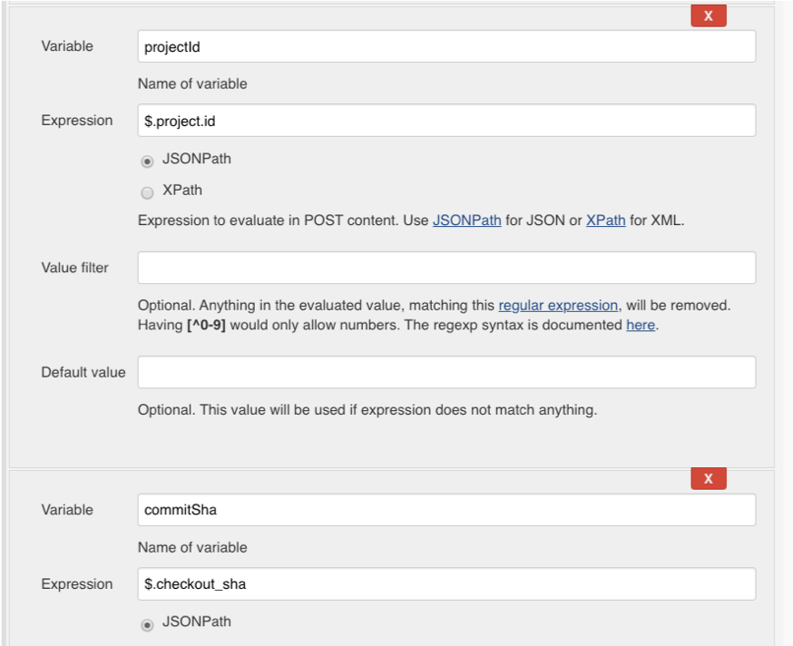

ok！很好，我们接下来在共享库创建一个文件`src/org/devops/gitlab.groovy`,这个文件用与后续的Gitlab操作。然后我们在jenkins中添加一个凭据用户存储Gitlab的token，这里我定义的凭据名称是`gitlab-token` 。我们首先使用`httpRequest`封装请求Gitlab的API地址，然后使用`withCredentials`获取Jenkins中的凭据`gitlab-token`赋值给变量`gitlabToken`用于认证使用。

```
package org.devops

//封装HTTP请求
def HttpReq(reqType,reqUrl,reqBody){
    def gitServer = "http://192.168.1.200:30088/api/v4"
    withCredentials([string(credentialsId: 'gitlab-token', variable: 'gitlabToken')]) {
      result = httpRequest customHeaders: [[maskValue: true, name: 'PRIVATE-TOKEN', value: "${gitlabToken}"]], 
                httpMode: reqType, 
                contentType: "APPLICATION_JSON",
                consoleLogResponseBody: true,
                ignoreSslErrors: true, 
                requestBody: reqBody,
                url: "${gitServer}/${reqUrl}"
                //quiet: true
    }
    return result
}
```
{}
如果上面的内容你有点看不懂了，嘿嘿，先放放。你可以去了解下关于HTTP请求相关基础知识了。
{}


我们开始添加变更提交状态的方法(记住我们现在还在gitlab.groovy文件中哦)，我们定义一个`ChangeCommitStatus()`方法，具有三个参数分别为项目ID、提交ID、提交状态 `projectId`，`commitSha`,`status`。然后使用我们上面封装好的方法发送`POST`请求。

```
//更改提交状态
def ChangeCommitStatus(projectId,commitSha,status){
    commitApi = "projects/${projectId}/statuses/${commitSha}?state=${status}"
    response = HttpReq('POST',commitApi,'')
    println(response)
    return response
}
```

到此我们在共享库的配置就完成了，接下来在Jenkinsfile中引用并进行调试。首先我们先加载了共享库`jenkinslibrary` 然后引用了gitlab.groovy。当流水线开始运行的时候我们将当前这次提交的状态为`running`运行中状态，当流水线构建成功我们会把状态变为`success`，当流水线失败了或者被取消了我们会将状态变为`failed`，`canceled`。

```
#!groovy

@Library('jenkinslibrary@master') _

//func from shareibrary
def gitlab = new org.devops.gitlab()

//branch
branchName = branch - "refs/heads/"
currentBuild.description = "Trigger by ${userName} ${branch}"
gitlab.ChangeCommitStatus(projectId,commitSha,"running")


//pipeline
pipeline{
    agent { node { label "build"}}
    stages{

        stage("CheckOut"){
            steps{
                script{
                    println("${branchName}")
                }
            }
        }
    }

    post {
        always{
            script{
                println("always")
            }
        }
        
        success{
            script{
                println("success")
                gitlab.ChangeCommitStatus(projectId,commitSha,"success")
                
            }
        
        }
        failure{
            script{
                println("failure")
                gitlab.ChangeCommitStatus(projectId,commitSha,"failed")
               
            }
        }
        
        aborted{
            script{
                println("aborted")
                gitlab.ChangeCommitStatus(projectId,commitSha,"canceled")
            }
        
        }
    
    }
    
}
```

如果调试没有问题，那么此时你可以登录gitlab系统当前项目的分支的提交的状态了！但是你是否觉得还差点什么？ 如果开发人员提交了，然后流水线自动执行了，最后失败了怎么办？ 要求开发人员放下工作实时去看？我觉得发送一个通知会更好一些！ 例如邮件通知。好吧，开始配置！

#### 构建失败邮件通知
首先要为每个开发人员分配一个邮箱，并且要在Gitlab中填写好。登录个人用户进行配置哦！没错，在这里配置邮箱的意义就是方便后面我们在jenkins中过滤获取。当然如果公司邮箱具有特征：用户名@xxx.com。就不用配置了因为前面已经获取的用户名。当然很多时候不是这样的，所以我们有必要把这个配置好。

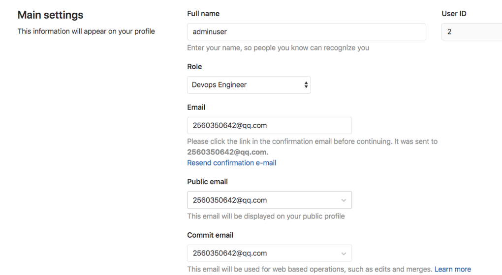

配置好邮箱之后，我们需要在Jenkins中配置邮件通知和项目配置。我们在项目中触发器添加一个参数`userEmail`。

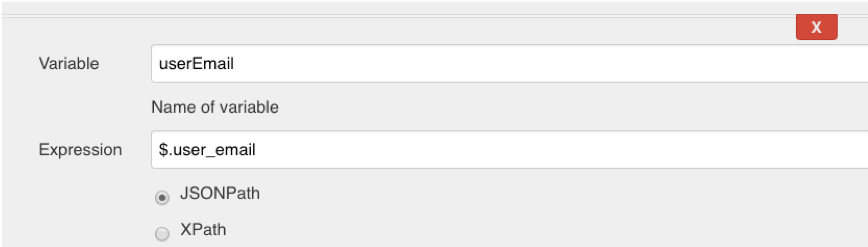

Jenkins需要配置邮件通知，安装插件`Email Extension`，然后进入系统管理-> `系统设置` ->`Extended E-email Notification`。这里我使用的是QQ邮箱，填写SMTP服务器地址`smtp.qq.com` 和端口 `465`注意要开启SSL，密码为授权码。


邮件通知的功能很重要，我们要为每条流水线都加上这个步骤，我们在共享库中封装一个`toemail.groovy`。 新建文件`src/org/devops/toemail.groovy`。在这个文件中，我们写了一段HTML代码，主要展示Jenkins的构建信息。

```
package org.devops

//定义邮件内容
def Email(status,emailUser){
    emailext body: """
            <!DOCTYPE html> 
            <html> 
            <head> 
            <meta charset="UTF-8"> 
            </head> 
            <body leftmargin="8" marginwidth="0" topmargin="8" marginheight="4" offset="0"> 
                
                <table width="95%" cellpadding="0" cellspacing="0" style="font-size: 11pt; font-family: Tahoma, Arial, Helvetica, sans-serif">   
                    <tr> 
                        <td><br /> 
                            <b><font color="#0B610B">构建信息</font></b> 
                        </td> 
                    </tr> 
                    <tr> 
                        <td> 
                            <ul> 
                                <li>项目名称：${JOB_NAME}</li>         
                                <li>构建编号：${BUILD_ID}</li> 
                                <li>构建状态: ${status} </li>                         
                                <li>项目地址：<a href="${BUILD_URL}">${BUILD_URL}</a></li>    
                                <li>构建日志：<a href="${BUILD_URL}console">${BUILD_URL}console</a></li> 
                            </ul> 
                        </td> 
                    </tr> 
                    <tr>  
                </table> 
            </body> 
            </html>  """,
            subject: "Jenkins-${JOB_NAME}项目构建信息 ",
            to: emailUser    
}
```

在流水线中引用

```
#!groovy

@Library('jenkinslibrary@master') _

//func from shareibrary
def gitlab = new org.devops.gitlab()
def toemail = new org.devops.toemail()

//branch
branchName = branch - "refs/heads/"
currentBuild.description = "Trigger by ${userName} ${branch}"
gitlab.ChangeCommitStatus(projectId,commitSha,"running")


//pipeline
pipeline{
    agent { node { label "build"}}
    stages{

        stage("CheckOut"){
            steps{
                script{
                    println("${branchName}")
                }
            }
        }
    }

    post {
        always{
            script{
                println("always")
            }
        }
        
        success{
            script{
                println("success")
                gitlab.ChangeCommitStatus(projectId,commitSha,"success")
                toemail.Email("流水线成功",userEmail)
            }
        
        }
        failure{
            script{
                println("failure")
                gitlab.ChangeCommitStatus(projectId,commitSha,"failed")
                toemail.Email("流水线失败了！",userEmail)
            }
        }
        
        aborted{
            script{
                println("aborted")
                gitlab.ChangeCommitStatus(projectId,commitSha,"canceled")
                toemail.Email("流水线被取消了！",userEmail)
            }
        
        }
    
    }
    
}
```

接下来可以调试了，如果没有问题会在邮箱中看到此封邮件。
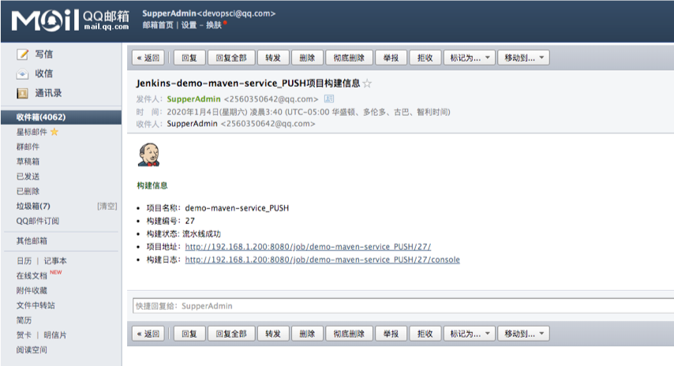


#### 过滤特殊push请求
你可能发现问题了，新建一个分支或者标签也会出现构建，这个构建是没有意义的。我们需要排除掉。没错，jenkins 的 `Generic webHook` 也是支持的。

参考官方的说明:https://github.com/jenkinsci/generic-webhook-trigger-plugin/tree/master/src/test/resources/org/jenkinsci/plugins/gwt/bdd

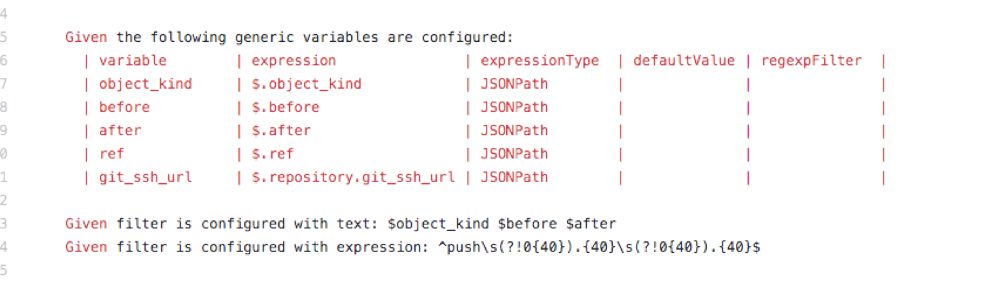


添加三个变量，获取当前的提交信息 `$object_kind $before $after`
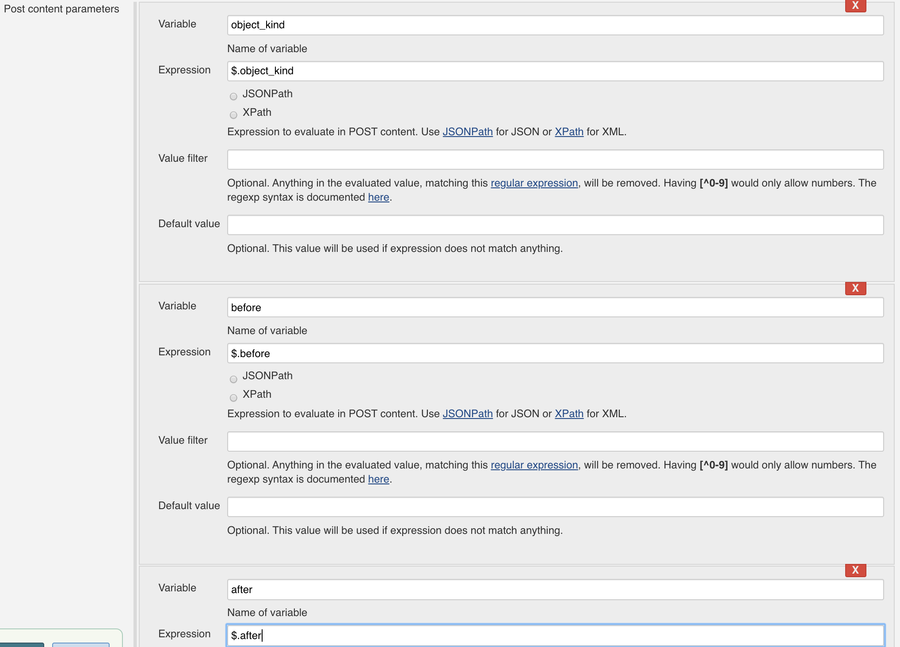


通过正则表达式配置触发条件：Expression `^push\s(?!0{40}).{40}\s(?!0{40}).{40}$` Text `$object_kind $before $after`。 push请求只有after和before的值都不是40个0的时候触发构建（为40个0的情况是删除分支或者新建分支）

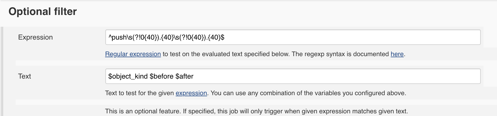

Ok! 提交流水线配置好了，可以玩耍了~。

### 合并流水线
关于合并流水线的配置之前要把提交流水线配置好，当提交流水线配置好了，合并流水线只需要修改一个配置。

当流水线成功后才可以合并：会检查原分支中的最后一次提交的状态是否为success。

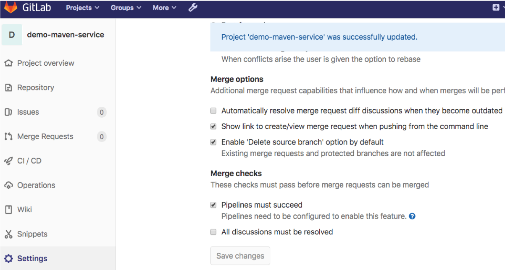

当原分支最后一次提交的状态为success，则可以合并。
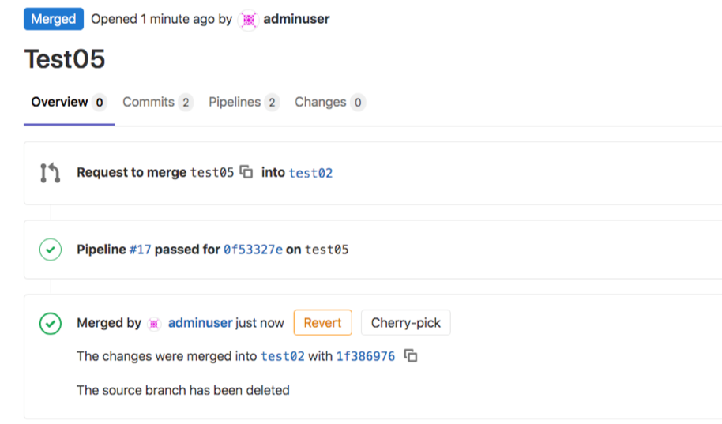

---

