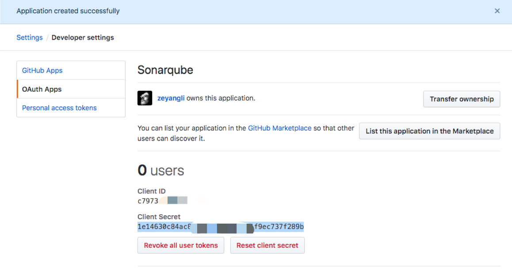

{}
您好，本章主要我们主要学习与质量管理平台Sonarqube集成。
{}


### 目录

+ [认识sonarqube](#认识sonarqube)
+ [sonarqube配置管理](#sonarqube配置管理)
+ [项目分析](#项目分析)
+ [自动化分析](#自动化分析)
+ [sonarqube接口](#sonarqube接口)
+ [配置多分支](#配置多分支)

---

### 认识sonarqube

#### 架构

* 一台SonarQube Server启动3个主要过程：
  - Web服务器，供开发人员，管理人员浏览高质量的快照并配置SonarQube实例
  - 基于Elasticsearch的Search Server从UI进行后退搜索
  - Compute Engine服务器，负责处理代码分析报告并将其保存在SonarQube数据库中

* 一个SonarQube数据库要存储：
  - SonarQube实例的配置（安全性，插件设置等）
  - 项目，视图等的质量快照。
* 服务器上安装了多个SonarQube插件，可能包括语言，SCM，集成，身份验证和管理插件
* 在构建/持续集成服务器上运行一个或多个SonarScanner，以分析项目


#### 工作原理
开发人员在IDE开发代码，可以安装SonarLint插件进行提交前代码扫描
当开发人员提交代码到版本控制系统中，自动触发jenkins进行代码扫描


#### 版本
开源社区版、开发版、企业版、数据中心版


#### 安装
我们这里使用Docker运行一个测试的环境，可以参考博客安装
博文地址： https://www.cnblogs.com/mascot1/p/11179767.html

```bash
docker run --rm -d --name sonarqube \
-p 9000:9000 \
-v ${LOCALDIR}/sonar/sonarqube_conf:/opt/sonarqube/conf \
-v ${LOCALDIR}/sonar/sonarqube_extensions:/opt/sonarqube/extensions \
-v ${LOCALDIR}/sonar/sonarqube_logs:/opt/sonarqube/logs \
-v ${LOCALDIR}/sonar/sonarqube_data:/opt/sonarqube/data \
sonarqube:7.9.2-community
```

WEB 页面  http://127.0.0.1:9000


### sonarqube配置管理

#### 强制登录
默认所有项目都可以公开的查看，在企业内肯定要配置成私有的。只有登录后才能查看。


#### ldap集成
安装LDAP插件


不用找了哦，页面上没有LDAP配置。需要修改sonar配置文件，然后重启服务器。

```
#LDAP settings
#admin
sonar.security.realm=LDAP
ldap.url=ldap://192.168.1.200:389
ldap.bindDn=cn=admin,dc=devops,dc=com
ldap.bindPassword=ldap12344
#users
ldap.user.baseDn=ou=jenkins,dc=devops,dc=com
ldap.user.request=(&(objectClass=inetOrgPerson)(cn={login}))
ldap.user.realNameAttribute=cn
ldap.user.emailAttribute=mail
```
#### gitlab认证集成

安装GitlabAuth插件


在gitlab中创建一个应用 系统设置 应用管理，填写`http://sonarserver:9000/oauth2/callback/gitlab`


接下来在sonarqube中配置gitlab信息。这个真的有图形页面，可以直接配置。主要填写gitlab的信息。


登录时出现此选项表明成功了


#### github认证集成
安装GithubAuth插件


在github中创建一个应用 系统设置 应用管理，填写`http://sonarserver:9000/oauth2/callback`



接下来在sonarqube中配置 


最终效果


### 项目分析

#### 安装配置sonarscanner
下载地址：https://docs.sonarqube.org/display/SCAN/Analyzing+with+SonarQube+Scanner



```
tar zxf sonar-scanner-xxxx.tar.gz -C /usr/local

vim /etc/profile

export SCANNER_HOME=/usr/local/sonar-scannerxxx
export PATH=$PATH:$SCANNER_HOME/bin

source /etc/profile 
```


#### 本地分析项目

`sonar.projectKey` 指定项目的关键字，`sonar.host.url`指定服务器地址（可以直接在配置文件中写死）,`projectName`指定项目的名称, `projectVersion`指定项目的版本(可以用构建时间和构建ID定义),`login`指定登录用户名,`password`指定登录用户密码, `projectDescription`指定项目的描述信息, `links.homepage`指定项目的主页（超链接）, `sources`指定扫描的目录, `sourceEncoding`指定扫描时的编码, `java.binaries`指定编译后的类文件目录(必填), `java.test.binaries`指定编译后的测试类目录,`java.surefire.report`指定测试报告目录。

```bash
sonar-scanner -Dsonar.host.url=http://192.168.1.200:9000 \
-Dsonar.projectKey=demo-maven-service \
-Dsonar.projectName=demo-maven-service \
-Dsonar.projectVersion=1.0 \
-Dsonar.login=admin \
-Dsonar.password=admin \
-Dsonar.ws.timeout=30 \
-Dsonar.projectDescription="my first project!" \
-Dsonar.links.homepage=http://www.baidu.com \
-Dsonar.sources=src \
-Dsonar.sourceEncoding=UTF-8 \
-Dsonar.java.binaries=target/classes \
-Dsonar.java.test.binaries=target/test-classes \
-Dsonar.java.surefire.report=target/surefire-reports
```


### 自动化分析

在jenkins中安装插件`sonarqube scanner` 配置SonarQube服务器：登录Jenkins，然后转到“ 管理Jenkins”>“配置系统”。
向下滚动到SonarQube配置部分，单击Add SonarQube，然后添加提示您的值。
服务器身份验证令牌应创建为“机密文本”凭据。


首先我们在共享库中定义一个sonarqube.groovy，用与扫描。新建文件`src/org/devops/sonarqube.groovy`  在这里我们定义了一个服务器列表,用于选择本次扫描使用的服务器（存在多个sonar的时候很有用处） 使用`withSonarQubeEnv`使用在Jenkins中配置sonar环境。这个方法有5个参数`服务器类型、项目名称、项目描述、项目扫描路径、分支名称`。


```
package org.devops


//scan
def SonarScan(sonarServer,projectName,projectDesc,projectPath,branchName){
    
    //定义sonar服务器列表
    def servers = ["test":"sonarqube-test","prod":"sonarqube-prod"]
    
    //使用sonar服务器
    withSonarQubeEnv("${servers[sonarServer]}"){

        def scannerHome = "/home/jenkins/buildtools/sonar-scanner-3.2.0.1227-linux/"
        def sonarDate = sh  returnStdout: true, script: 'date  +%Y%m%d%H%M%S'
        sonarDate = sonarDate - "\n"
        
        sh """ 
            ${scannerHome}/bin/sonar-scanner -Dsonar.projectKey=${projectName} \
            -Dsonar.projectName=${projectName} -Dsonar.projectVersion=${sonarDate} -Dsonar.ws.timeout=30 \
            -Dsonar.projectDescription=${projectDesc} -Dsonar.links.homepage=http://www.baidu.com \
            -Dsonar.sources=${projectPath} -Dsonar.sourceEncoding=UTF-8 -Dsonar.java.binaries=target/classes \
            -Dsonar.java.test.binaries=target/test-classes -Dsonar.java.surefire.report=target/surefire-reports  -Dsonar.branch.name=${branchName} -X
        """
    }
}

```

在Jenkinsfile中引用: 我们首先加载`jenkinslibrary`共享库，引用`sonarqube.groovy`。

```#!groovy

@Library('jenkinslibrary@master') _

//func from shareibrary
def sonar = new org.devops.sonarqube()


pipeline {
    agent any
    
    stages {
        stage("codescan"){
            steps{
                script{
                    sonar.SonarScan("test","${JOB_NAME}","${JOB_NAME}","src")
                }
            }
        }
    }

}
```
效果：此时流水线运行完成后，在项目中可以看到Sonarqube的链接。点击即可进入sonarqube


项目的扫描结果


### sonarqube接口
根据sonar官方的文档获取接口使用详情。

```
//查找项目
api/projects/search?projects=${projectName}"

//创建项目
api/projects/create?name=${projectName}&project=${projectName}"
   
//更新语言规则集
api/qualityprofiles/add_project?language=${language}&qualityProfile=${qualityProfile}&project=${projectName}"

//项目授权
api/permissions/apply_template?projectKey=${projectKey}&templateName=${templateName}"

//更新质量阈
api/qualitygates/select?projectKey=${projectKey}&gateId=${gateId}"

```


封装到共享库中`sonarapi.groovy`

```
package org.devops


//封装HTTP

def HttpReq(reqType,reqUrl,reqBody){
    def sonarServer = "http://192.168.1.200:30090/api"
   
    result = httpRequest authentication: 'sonar-admin-user',
            httpMode: reqType, 
            contentType: "APPLICATION_JSON",
            consoleLogResponseBody: true,
            ignoreSslErrors: true, 
            requestBody: reqBody,
            url: "${sonarServer}/${reqUrl}"
            //quiet: true
    
    return result
}


//获取Sonar质量阈状态
def GetProjectStatus(projectName){
    apiUrl = "project_branches/list?project=${projectName}"
    response = HttpReq("GET",apiUrl,'')
    
    response = readJSON text: """${response.content}"""
    result = response["branches"][0]["status"]["qualityGateStatus"]
    
    //println(response)
    
   return result
}

//搜索Sonar项目
def SerarchProject(projectName){
    apiUrl = "projects/search?projects=${projectName}"
    response = HttpReq("GET",apiUrl,'')

    response = readJSON text: """${response.content}"""
    result = response["paging"]["total"]

    if(result.toString() == "0"){
       return "false"
    } else {
       return "true"
    }
}

//创建Sonar项目
def CreateProject(projectName){
    apiUrl =  "projects/create?name=${projectName}&project=${projectName}"
    response = HttpReq("POST",apiUrl,'')
    println(response)
}

//配置项目质量规则

def ConfigQualityProfiles(projectName,lang,qpname){
    apiUrl = "qualityprofiles/add_project?language=${lang}&project=${projectName}&qualityProfile=${qpname}"
    response = HttpReq("POST",apiUrl,'')
    println(response)
}


//获取质量阈ID
def GetQualtyGateId(gateName){
    apiUrl= "qualitygates/show?name=${gateName}"
    response = HttpReq("GET",apiUrl,'')
    response = readJSON text: """${response.content}"""
    result = response["id"]
    
    return result
}

//配置项目质量阈

def ConfigQualityGates(projectName,gateName){
    gateId = GetQualtyGateId(gateName)
    apiUrl = "qualitygates/select?gateId=${gateId}&projectKey=${projectName}"
    response = HttpReq("POST",apiUrl,'')
    println(response)println(response)
}

```


应用实践:

```
stage("QA"){
    steps {
        script{
            //搜索项目
            result = sonarapi.SerarchProject("${JOB_NAME}")
            println(result)
            
            //判断项目是否存在
            if (result == "false"){
                println("${JOB_NAME}---项目不存在,准备创建项目---> ${JOB_NAME}！")
                sonarapi.CreateProject("${JOB_NAME}")
            } else {
                println("${JOB_NAME}---项目已存在！")
            }
            
            //配置项目质量规则
            qpName="${JOB_NAME}".split("-")[0]   //Sonar%20way
            sonarapi.ConfigQualityProfiles("${JOB_NAME}","java",qpName)
        
            //配置质量阈
            sonarapi.ConfigQualityGates("${JOB_NAME}",qpName)
        
            //代码扫描
            sonar.SonarScan("test","${JOB_NAME}","${JOB_NAME}","src")
            

            sleep 30
            //获取扫描结果
            result = sonarapi.GetProjectStatus("${JOB_NAME}")
            
            
            println(result)
            if (result.toString() == "ERROR"){
                error " 代码质量阈错误！请及时修复！"
            } else {
                println(result)
            }
        }
    }
}


```


### 配置多分支

将插件放到两个目录中，然后重启sonar


扫描参数增加 –Dsonar.branch.name=


效果


---