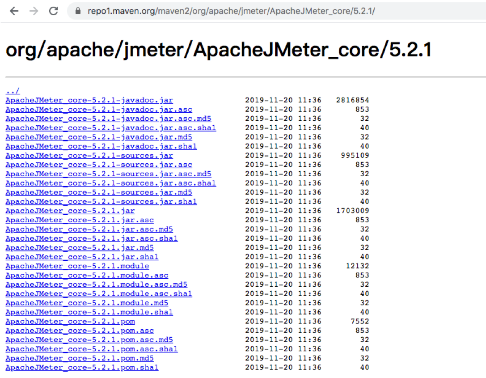

{}
您好，本章我们主要讲述Jenkins与制品库nexus、artiifactory集成，上传下载制品。
{}


### 目录
+ [部署](#部署)
+ [功能](#功能)
+ [基本概念](#基本概念)
+ [上传制品](#上传制品)
+ [集成jenkins上传制品](#集成jenkins上传制品)
+ [使用nexus插件上传制品](#使用nexus插件上传制品)
+ [发布制品](#发布制品)
+ [nexus接口](#nexus接口)
+ [artifactory集成](#artifactory集成)
  - [构建制品](#构建制品)
  - [上传制品](#上传制品)

---

### 部署

测试环境使用Docker安装部署

```bash
docker run -id \
--privileged=true --name=nexus3 \
-p 8081:8081 \
-v ${LOCALDIR}/nexus3/nexus-data:/nexus-data \
sonatype/nexus3:3.20.1
```


安装完成后默认的admin账号密码存储在了数据目录，获取初始化密码后更新账号密码。


### 功能
私服仓库： 本地maven私服加快构建速度
代理仓库：将公网等第三方提供的仓库代理到本地


### 基本概念

组件是一种资源，在构建过程中需要依赖。它可以是整个应用程序，也可以是静态资源（例如图片）。
通常，这些组件是各种文件的存档，包括：类文件中的Java字节码、C对象文件、文本文件、二进制文件。
组件的多种格式，例如：Java JAR，WAR，EAR格式；普通ZIP或.tar.gz文件；其他软件包格式，例如NuGet软件包，Ruby gems，NPM软件包；可执行文件格式，例如.exe 或.sh 文件，Android APK文件，各种安装程序格式。


组件可以由多个嵌套组件本身组成。组件提供了所有构建块和功能。可以通过组装并添加自己的业务相关组件来创建功能强大的完整应用程序。在不同的工具链中，组件称为工件，程序包，捆绑包，归档和其他术语。概念和想法保持不变，组件用作通用术语。组件由一组特定值（坐标）标识。这些坐标的通用集是组，名称和版本的用法。这些坐标的名称和用法随所使用的工具链而变化。组件也可以成为其他元数据的基础


资产 ：例如Maven项目中的pom文件算是资产一部分，包含元数据的重要补充。
实际的存档文件（pom.xml）是与组件（ jar/war包）关联的资产。但是，更复杂的格式具有与组件（jar包）关联的众多资产（pom）。例如，Maven存储库中的典型JAR组件至少由POM和JAR文件定义-两者均构成属于同一组件的单独资产。其他文件（例如JavaDoc或Sources JAR文件）是属于同一组件的资产。
另一方面，Docker格式为资产提供唯一的标识符，并将其称为Docker层。这些资产可用于不同的组件-Docker映像。例如，一个Docker层可以是多个Docker映像引用的特定操作系统。




### 上传制品
我们需要在nexus中创建一个新的仓库maven-hostd,同时我们需要在maven的配置文件`settings.xml`中配置maven-hostd认证。如下：

```
    <server>
      <id>maven-hostd</id>
      <username>admin</username>
      <password>admin123</password>
    </server>
```

注意使用mvn deploy 发布时，server.id == respository.id。


### 集成jenkins上传制品

步骤：获取Jar包名称、读取pom文件、获取坐标信息、使用mvn deploy上传。


```
def jarName = sh returnStdout: true, script: "cd target;ls *.jar"
jarName = jarName - "\n"

def pom = readMavenPom file: 'pom.xml'
pomVersion = "${pom.version}"
pomArtifact = "${pom.artifactId}"
pomPackaging = "${pom.packaging}"
pomGroupId = "${pom.groupId}"

println("${pomGroupId}-${pomArtifact}-${pomVersion}-${pomPackaging}")

def mvnHome = tool "M2"
sh  """ 
    cd target/
    ${mvnHome}/bin/mvn deploy:deploy-file -Dmaven.test.skip=true  \
                            -Dfile=${jarName} -DgroupId=${pomGroupId} \
                            -DartifactId=${pomArtifact} -Dversion=${pomVersion}  \
                            -Dpackaging=${pomPackaging} -DrepositoryId=maven-hostd \
                            -Durl=http://192.168.1.200:30083/repository/maven-hostd 
    """
```


### 使用nexus插件上传制品

安装nexus artifact uploader插件、使用片段生成器生成DSL。


开始编写Jenkinsfile
```
//use nexus plugin
def repoName = "maven-hostd"
def filePath = "target/${jarName}"
nexusArtifactUploader artifacts: [[artifactId: "${pomArtifact}", 
                                    classifier: '', 
                                    file: "${filePath}", 
                                    type: "${pomPackaging}"]], 
                        credentialsId: 'nexus-admin-user', 
                        groupId: "${pomGroupId}", 
                        nexusUrl: '192.168.1.200:30083', 
                        nexusVersion: 'nexus3', 
                        protocol: 'http', 
                        repository: "${repoName}", 
                        version: "${pomVersion}"
```

查看上传的日志

查看仓库制品


### 发布制品
安装`Maven Artifact ChoiceListProvider (Nexus)`插件


用户选择制品，在应用服务器通过salt、ansible下载制品并部署


### nexus接口

```
package org.devops


//封装HTTP
def HttpReq(reqType,reqUrl,reqBody){
    def sonarServer = "http://192.168.1.200:30083/service/rest"
   
    result = httpRequest authentication: 'nexus-admin-user',
            httpMode: reqType, 
            contentType: "APPLICATION_JSON",
            consoleLogResponseBody: true,
            ignoreSslErrors: true, 
            requestBody: reqBody,
            url: "${sonarServer}/${reqUrl}",
            quiet: true
    
    return result
}


//获取仓库中所有组件

def GetRepoComponents(repoName){
    apiUrl = "/v1/components?repository=${repoName}"
    response = HttpReq("GET",apiUrl,'')
    
    response = readJSON text: """${response.content}"""
    println(response["items"].size())
    
    return response["items"]
}


//获取单件组件

def GetComponentsId(repoName,groupId,artifactId,version){
    println("获取单件组件ID")
    result = GetRepoComponents(repoName) 
    
    for (component in result){
        
        if (component["group"] == groupId && component["name"] == artifactId && component["version"] == version  ){
            
            componentId = component["id"]
            
            return componentId
        }
    }
    
    println(componentId)
}

//获取组件信息
def GetSingleComponents(repoName,groupId,artifactId,version){
    println("获取单件组件信息")
    componentId = GetComponentsId(repoName,groupId,artifactId,version)
    apiUrl = "/v1/components/${componentId}"
    response = HttpReq("GET",apiUrl,'')
    
    response = readJSON text: """${response.content}"""
    println(response["assets"]["downloadUrl"])
}
```


### artifactory集成

安装Artifactory插件，配置Artifactory仓库信息（仓库地址、用户认证信息）。


#### 构建制品

```
package org.devops

//Maven打包构建
def MavenBuild(buildShell){
    def server = Artifactory.newServer url: "http://192.168.1.200:30082/artifactory"
    def rtMaven = Artifactory.newMavenBuild()
    def buildInfo
    server.connection.timeout = 300
    server.credentialsId = 'artifactory-admin-user' 
    //maven打包
    rtMaven.tool = 'M2' 
    buildInfo = Artifactory.newBuildInfo()

    String newBuildShell = "${buildShell}".toString()
    println(newBuildShell)
    rtMaven.run pom: 'pom.xml', goals: newBuildShell, buildInfo: buildInfo
    //上传build信息
    server.publishBuildInfo buildInfo
}


def main(buildType,buildShell){
    if(buildType == "mvn"){
        MavenBuild(buildShell)
    }
}
```

查看构建数据：


命名规范

```
仓库命名规范
业务/项目-环境类型   例如： demo-dev

制品命名规范
应用名称-版本号-构建ID.type  
例如： demo-myapp-service-1.jar

制品目录规范
  业务/项目
    应用名称
       版本号
          制品
```


#### 上传制品

```
rtUpload (
    serverId: "art1",
    spec:
        """{
        "files": [
            {
            "pattern": "target/${jarName}",
            "target": "${uploadDir}/"
            }
        ]
        }"""
)
```


---