{}
您好，本章我们主要讲述Jenkins与需求管理平台Jira集成。这篇文章是我根据我们当前团队的情况进行定制的，可能有些内容与大家不太一样。重点是告诉大家如何实现集成？关于细节问题可自由定制。 在这里要告诉大家的是思路。
{}


### 目录

+ [工具链调研分析](#工具链调研分析)
+ [实践](#实践)
+ [总结](#总结)

---

在这里先说一下，当前的现状。我们使用Jira的Git插件能够实现在Jira上面新建Gitlab分支（实现需求与代码基线关联），这个操作需要手动完成。使用Jira中的Git插件实现集成，能够实现在Jira系统对应的任务下面创建分支，或开发人员在创建分支的时候分支名称包含Jira ID则可以自动关联。 通过上面的描述你应该发现了存在的一些问题，例如：插件不稳定，资源消耗大。手动创建分支，增加了人员成本。


来我们先看下当前的分支策略（每个团队可能会有自己的一套分支策略）。
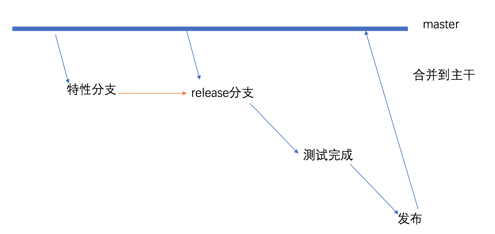

开发人员在特性分支进行开发，基于master分支创建一个版本分支（用于发布）。特性分支在特性环境验证通过后，将特性分支合并到版本分支，此时通过版本分支进行UAT测试环境、STAG预生产环境验证测试，测试通过通过版本分支发布PROD生产环境。生产环境发布完成后，将版本分支合并到master分支。


为解决上述问题，制作了改进方案。 我们想实现在Jira中创建故事或者任务(Jira中的issue)时自动在对应的代码库创建分支，故事或者任务在关联到发布（Jira中的release）之后自动在代码库中创建一个release分支和特性分支到release分支的合并请求。 


### 工具链调研分析
其实我们需要配置的是通过Jira的Webhook 触发Jenkins来操作Gitlab系统。主要有三个点：

* Jenkins项目配置触发器接收触发请求
* Jira系统配置webHook触发Jenkins
* Jenkins封装GitlabAPI完成相关操作


#### Jira调研与分析-webhook

关于Jira的webhook挺强大的几乎所有的事件都能支持，我们进入jira系统的管理页面，选择webhook。

填写配置触发器URL(Jenkins项目触发器地址)、通过JQL（Jira的一种查询语言类似于SQL）配置触发的项目、选择触发事件。

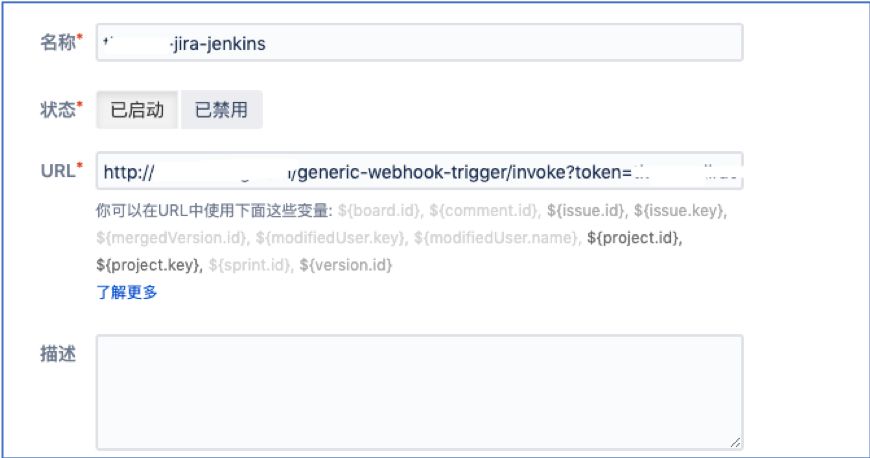
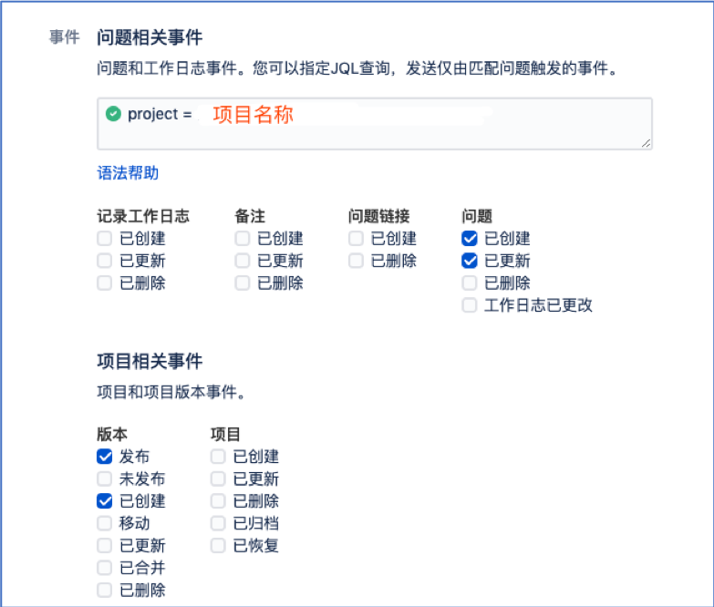

#### Jira调研与分析-webhookevent

在上面我们知道有webhook的概念，我们来分析要完成我们的需求所需要的事件类型。其实这些数据是在webhook中传递。Jira的事件类型如上图所示有很多，在这里我们用到了 问题创建`jira:issue_created`、问题更新`jira:issue_update`。


* 创建任务或者故事属于`jira:issue_created`事件。
* 任务或者故事关联上版本属于`jira:issue_updated`事件。

来一起看下Jira的webhook传递的JSON数据，如下图所示：

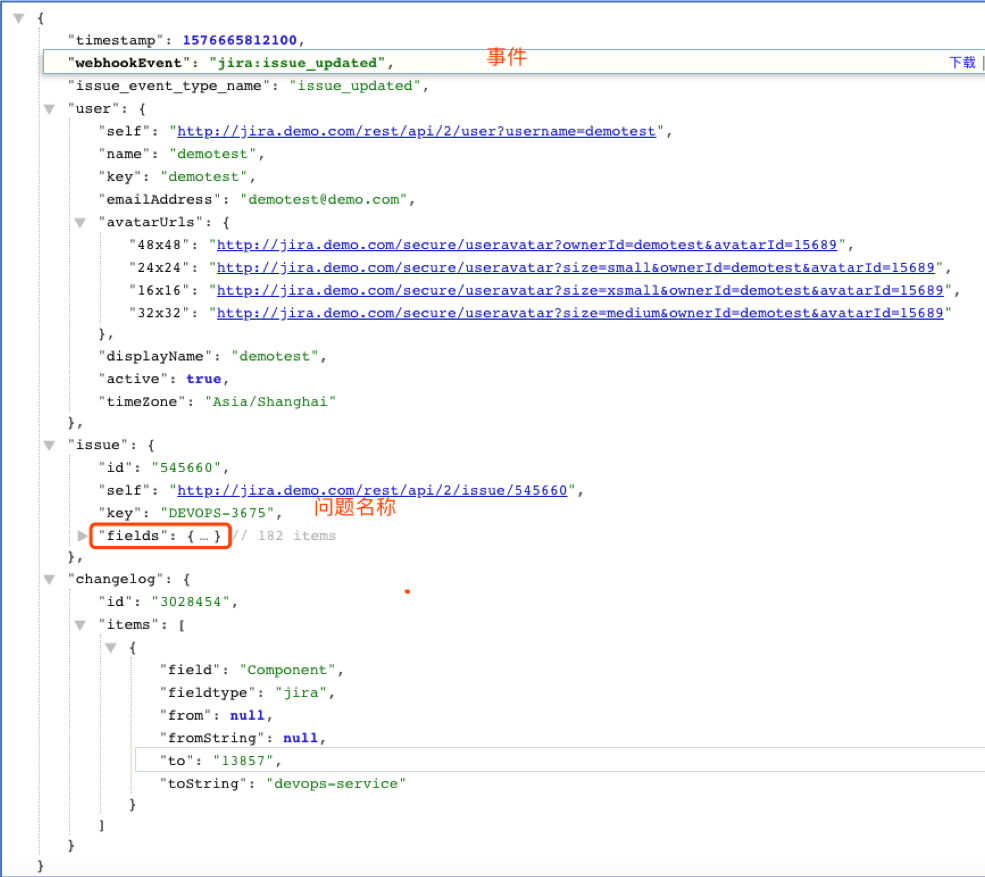


到此可以总结为Jira的功能已经完全满足了我们的需求。

#### Gitlab调研与分析
关于Gitlab要做的事情有2点，分别为:

* 创建分支（branch）
* 创建合并请求（merge request）

我们可以参考Gitlab的接口文档 https://docs.gitlab.com/ce/api/api_resources.html, 找出我们所需要的API。如下所示： 

```bash
# 获取项目ID接口
api/v4/projects?search=projectName
# 创建分支接口
api/v4/projects/${projectId}/repository/branches?branch=${newBranch}&ref=${refBranch}
# 创建合并请求接口
api/v4/projects/${projectId}/merge_requests
```

{}
我们找到了以上三个接口，是不是疑问`获取项目ID接口`是用来做什么的呢？ 其实这个就是用来通过项目名称获取项目的ID的。要想创建分支或者合并请求都是需要项目的ID的。项目名称就是Jira中的模块名称，也就是在Jira创建issue的时候必须要给此issue关联一个模块。后续我们根据此模块名称调用gitlab接口查询获取ID，以便进行后续的操作。
{}

#### Jenkins调研与分析- Generic Webhook Trigger

我们使用` Generic Webhook Trigger`来完成此次任务， 对于Jenkins来说，需要做的有3点：

* 配置触发器接收来自Jira的请求
* 分析Jira请求中传递的数据
* 封装Gitlab API完成相关操作

**分析数据** 获取hook中参数-获取问题名称-获取模块名称等数据
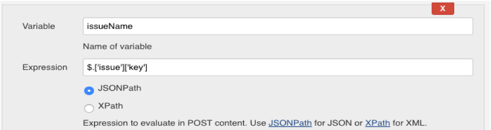

**配置触发器** 生成项目唯一Token-使用项目名称标识
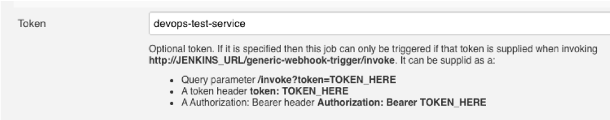

**配置触发过滤器** 过滤触发请求-限制只有故事任务等触发（在Jira中issue类型有很多种，这里可以灵活定义）
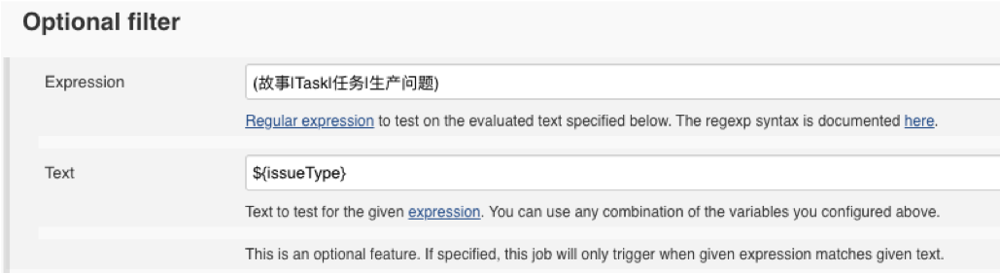


### 实践
上面的技术点你是否清楚了呢？ 接下来我们要上战场实践了。

#### 创建issue自动创建gitlab分支

**我想大概过程是这样的：**

* Jira: 我来创建与gitlab项目名称一致的模块。然后我来创建issue关联上模块。
* 此时通过webhook触发了Jenkins的项目。
* Jenkins: 我来接收来自Jira的请求，我在请求中获取到`issueName,components`等参数。
* Jenkins: 通过gitlab查询项目接口根据`components`来获取gitlab项目的ID。
* Jenkins: 然后根据以获取的项目ID和`issueName`参数，通过gitlab创建分支接口创建分支。


**技术实现细节是这样的**

要想实现在gitlab中创建分支，接口我们已经找到了，但是如何获取每个issue所关联的项目名称呢？我们自己维护一个关系表？当一个issue需要关联多个项目呢？ 此时我们需要用到jira中的模块。使用jira中的模块来作为gitlab中的项目（命名一致），我们在创建issue的同时需要关联模块（必须关联,否则创建不了哦）。所以第一件事情是**在Jira中创建模块，模块命名同Gitlab项目名称**  


此时我创建了一个模块`demo-maven-service`(我的gitlab项目名称也是这个)
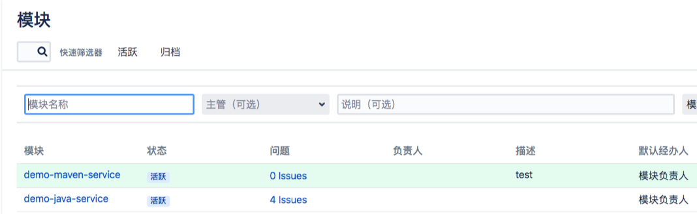

然后我（Jira）来创建issues，我创建一个任务，然后关联`demo-maven-service`模块 。此时证明：这个任务关联的是`demo-maven-service`这个代码库。也就是我要在`demo-maven-service`项目下创建一个`issueName`同名的分支（特性分支）。 

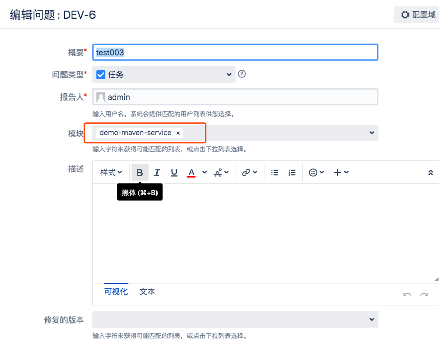


触发Jenkins项目： Jenkins 根据模块（components）在对应的仓库中创建分支（IssueName）。JIRA更新issues，Jenkins 根据模块（components）在对应的仓库中创建分支（issuesName）。


我的Jenkinsfile内容如下： 在这里我引入了我们自己封装好的`gitlab.groovy`，首先第一个步骤是`FileterData`分析数据，写了一个 `switch`语句来根据不同的`event`来获取不同的数据。`jira:issue_created`问题创建事件，我们需要获取的参数有**问题名称、触发人、关联模块、关联版本**。 然后第二个步骤是`CreateBranch`，我们通过gitlab的接口获取项目的ID，因为一个issue可能关联多个模块，所以这里是个list列表，后面遍历这个列表然后创建在对应的项目中创建分支。

```
#!groovy

@Library('jenkinslibrary') _

def gitlab = new org.devops.gitlab()

pipeline {
    agent { node { label "master"}}


    stages{

        stage("FileterData"){
            steps{
                script{
                    response = readJSON text: """${webHookData}"""

                    println(response)

                    env.eventType = response["webhookEvent"]

                    switch(eventType) {
                        case "jira:issue_created":
                            env.issueName = response['issue']['key']
                            env.userName = response['user']['name']
                            env.moduleNames = response['issue']['fields']['components']
                            env.fixVersion = response['issue']['fields']['fixVersions']
                            currentBuild.description = " Trigger by ${userName} ${eventType} ${issueName} "
                            break

                        default:
                            println("hello")
                    }
                }
            }
        }
        
        stage("CreateBranch"){

            when {
                anyOf {
                    environment name: 'eventType', value: 'jira:issue_created'   //issue 创建 /更新
                    environment name: 'eventType', value: 'jira:issue_updated' 
                }
            }

            steps{
                script{
                    def projectIds = []
                    println(issueName)

                    //获取项目Id
                    def projects = readJSON text: """${moduleNames}"""
                    for ( project in projects){
                        println(project["name"])
                        projectName = project["name"]
                        currentBuild.description += "\n project: ${projectName}"
                        repoName = projectName.split("-")[0]
                        
                        try {
                            projectId = gitlab.GetProjectID(repoName, projectName)
                            println(projectId)
                            projectIds.add(projectId)   
                        } catch(e){
                            println(e)
                            println("未获取到项目ID，请检查模块名称！")
                        }
                    } 

                    println(projectIds)  

                    
                    for (id in projectIds){
                        println("新建特性分支--> ${id} --> ${issueName}")
                        currentBuild.description += "\n 新建特性分支--> ${id} --> ${issueName}"
                        gitlab.CreateBranch(id,"master","${issueName}")
                    }
                }
            }
        }
    }
}
```


最终效果，登录gitlab进入项目中你应该能够看到跟当前issue同名的一个特性分支。


{}
为了避免重复创建分支导致流水线失败，我们需要在写gitlab方法时加上一个try catch捕获异常。
{}


#### 自动创建合并请求
JIRA更新issues到版本中。 Jenkins根据issues中的模块信息，在对应的仓库中创建release分支（fixVersion），并创建特性分支（issueName）到release分支的MR。 jira的issue更新事件有两个情况第一种是增加关联的模块，还有一种是将issue关联了版本。

我们先来创建一个版本
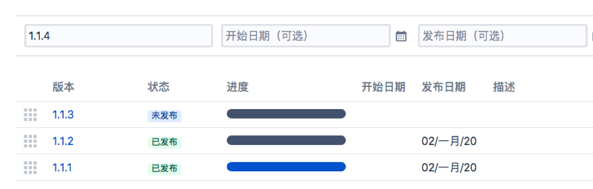
然后将issue关联一个版本

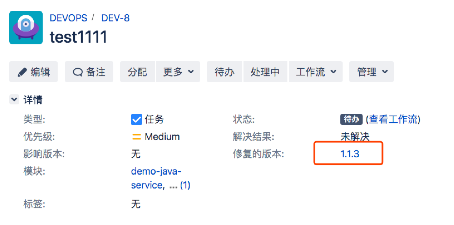

完善Jenkinsfile
```#!groovy

@Library('jenkinslibrary') _

def gitlab = new org.devops.gitlab()
pipeline {
    agent { node { label "master"}}


    stages{

        stage("FileterData"){
            steps{
                script{
                    response = readJSON text: """${webHookData}"""

                    println(response)

                    env.eventType = response["webhookEvent"]

                    switch(eventType) {
                        case "jira:issue_created":
                            env.issueName = response['issue']['key']
                            env.userName = response['user']['name']
                            env.moduleNames = response['issue']['fields']['components']
                            env.fixVersion = response['issue']['fields']['fixVersions']
                            currentBuild.description = " Trigger by ${userName} ${eventType} ${issueName} "
                            break

                        case "jira:issue_updated":
                            env.issueName = response['issue']['key']
                            env.userName = response['user']['name']
                            env.moduleNames = response['issue']['fields']['components']
                            env.fixVersion = response['issue']['fields']['fixVersions']
                            currentBuild.description = " Trigger by ${userName} ${eventType} ${issueName} "
                            break

                        default:
                            println("hello")
                    }
                }
            }
        }

        stage("CreateBranchOrMR"){

            when {
                anyOf {
                    environment name: 'eventType', value: 'jira:issue_created'   //issue 创建 /更新
                    environment name: 'eventType', value: 'jira:issue_updated' 
                }
            }

            steps{
                script{
                    def projectIds = []
                    println(issueName)
                    fixVersion = readJSON text: """${fixVersion}"""
                    println(fixVersion.size())

                    //获取项目Id
                    def projects = readJSON text: """${moduleNames}"""
                    for ( project in projects){
                        println(project["name"])
                        projectName = project["name"]
                        currentBuild.description += "\n project: ${projectName}"
                        repoName = projectName.split("-")[0]
                        
                        try {
                            projectId = gitlab.GetProjectID(repoName, projectName)
                            println(projectId)
                            projectIds.add(projectId)   
                        } catch(e){
                            println(e)
                            println("未获取到项目ID，请检查模块名称！")
                        }
                    } 

                    println(projectIds)  


                    if (fixVersion.size() == 0) {
                        for (id in projectIds){
                            println("新建特性分支--> ${id} --> ${issueName}")
                            currentBuild.description += "\n 新建特性分支--> ${id} --> ${issueName}"
                            gitlab.CreateBranch(id,"master","${issueName}")
                        }
                            
                        

                    } else {
                        fixVersion = fixVersion[0]['name']
                        println("Issue关联release操作,Jenkins创建合并请求")
                        currentBuild.description += "\n Issue关联release操作,Jenkins创建合并请求 \n ${issueName} --> RELEASE-${fixVersion}" 
                        
                        for (id in projectIds){

                            println("创建RELEASE-->${id} -->${fixVersion}分支")
                            gitlab.CreateBranch(id,"master","RELEASE-${fixVersion}")


                            
                            println("创建合并请求 ${issueName} ---> RELEASE-${fixVersion}")
                            gitlab.CreateMr(id,"${issueName}","RELEASE-${fixVersion}","${issueName}--->RELEASE-${fixVersion}")
                            
                        }
                    } 
                }
            }
        }
    }
}


```


Gitlab效果：查看合并请求


### 总结
通过以上两个实践，相信你已经知道了如何实现系统间的集成，没错主要是通过webhook和api。 接下来如果有需求可以独立去灵活定义了哦。

---