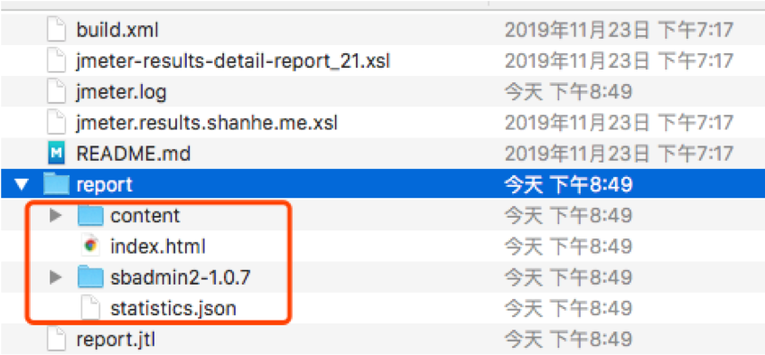
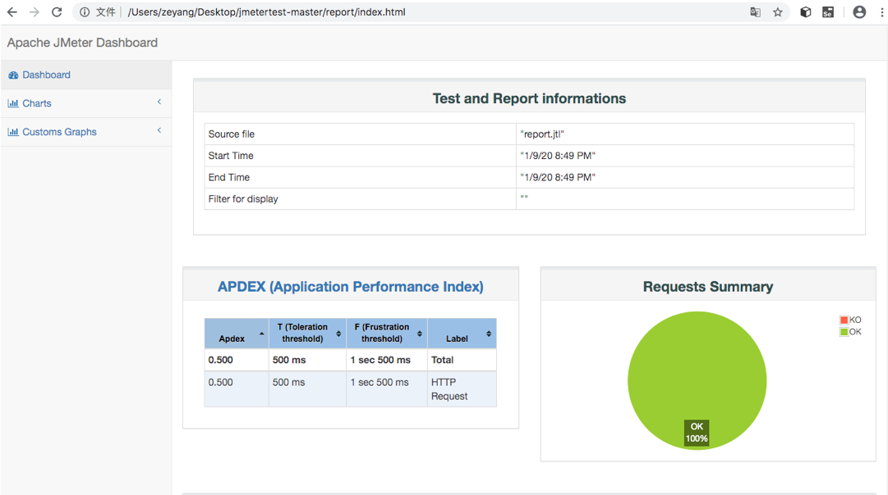
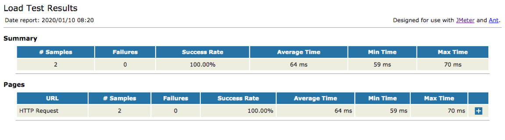
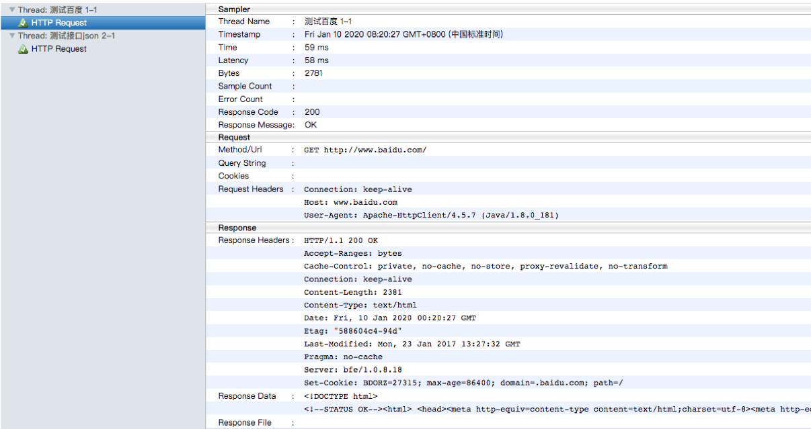
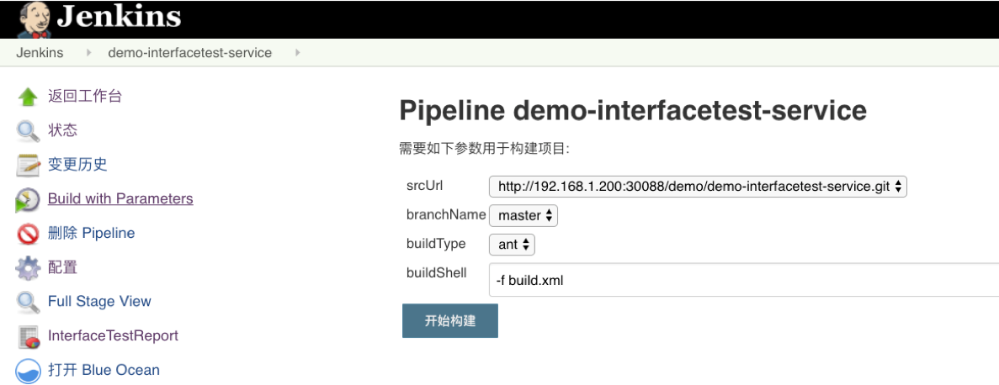

{}
您好，本章我们主要讲述Jenkins+jmeter自动化接口测试。
{}


### 目录

---

接口测试定义为一种软件测试类型，用于验证两个不同软件系统之间的通信是否正确完成。集成两个组件的连接称为接口。计算机世界中的此接口可以是API，Web服务等之类的东西。这些连接服务或接口的测试称为接口测试。接口实际上是由一组命令，消息和其他允许设备与用户之间进行通信的属性组成的软件。

### 运行测试用例

```
jmeter -n -t scripts/blog.jmx  -l report.jtl 
-e -o report -Jjmeter.save.saveservice.output_format=csv
```

参数说明:

* -n: 非GUI模式执行JMeter
* -t: 执行测试文件所在的位置
* -l: 指定生成测试结果的保存文件，jtl文件格式
* -e: 测试结束后，生成测试报告-o: 指定测试报告的存放位置

看下运行的效果：测试报告已生成是HTML文件，可直接打开。






### 批量运行用例

我们可以使用ant与Jmeter集成build.xml部分内容。 仓库地址：https://github.com/zeyangli/jmetertest.git

```xml
<?xml version="1.0" encoding="utf8"?>
<!-- 拷贝报告所需的图片资源至目标目录 -->
<project name="ant-jmeter-test" default="run" basedir=".">
<tstamp>
<format property="time" pattern="yyyyMMddHHmm" />
</tstamp>
<!-- 需要改成自己本地的jmeter目录--> 
<property name="jmeter.home" value="/usr/local/buildtools/apache-jmeter-5.2.1" />
<!-- jmeter生成的jtl格式的结果报告的路径--> 
<property name="jmeter.result.jtl.dir" value="./result/jtlfile" />
<!-- jmeter生成的html格式的结果报告的路径-->
<property name="jmeter.result.html.dir" value="./result/htmlfile" />
<!-- ʺ生成的报告的前缀--> 
<property name="ReportName" value="TestReport_" />
<property name="jmeter.result.jtlName" value="${jmeter.result.jtl.dir}/${ReportName}${time}.jtl" />
<property name="jmeter.result.htmlName" value="${jmeter.result.html.dir}/${time}_SummaryReport.html" />
<property name="jmeter.detail.result.jtlName" value="${jmeter.result.jtl.dir}/${ReportName}${time}.jtl" />
<property name="jmeter.detail.result.htmlName" value="${jmeter.result.html.dir}/${time}_DetailReport.html" />
<target name="run">
<antcall target="test" />
<antcall target="report" />
</target>
<target name="test">
<taskdef name="jmeter" classname="org.programmerplanet.ant.taskdefs.jmeter.JMeterTask" />
<jmeter jmeterhome="${jmeter.home}" resultlog="${jmeter.result.jtlName}">
<!-- 声明要运行的脚本“*.jmx”指包含此目录下的所有jmeter脚本-->
<testplans dir="./scripts" includes="*.jmx" />
<property name="jmeter.save.saveservice.output_format" value="xml"/>
</jmeter>
</target>
```

运行用例

```
Password:
Buildfile: /Users/zeyang/Desktop/jmetertest-master/build.xml

run:

test:
   [jmeter] Executing test plan: /Users/zeyang/Desktop/jmetertest-master/scripts/blog.jmx ==> /Users/zeyang/Desktop/jmetertest-master/result/jtlfile/TestReport_202001100820.jtl
   [jmeter] Creating summariser <summary>
   [jmeter] Created the tree successfully using /Users/zeyang/Desktop/jmetertest-master/scripts/blog.jmx
   [jmeter] Starting the test @ Fri Jan 10 08:20:26 CST 2020 (1578615626561)
   [jmeter] Waiting for possible Shutdown/StopTestNow/HeapDump/ThreadDump message on port 4445
   [jmeter] summary =      2 in 00:00:00 =    8.2/s Avg:    64 Min:    59 Max:    70 Err:     0 (0.00%)
   [jmeter] Tidying up ...    @ Fri Jan 10 08:20:27 CST 2020 (1578615627287)
   [jmeter] ... end of run

report:
     [xslt] Processing /Users/zeyang/Desktop/jmetertest-master/result/jtlfile/TestReport_202001100820.jtl to /Users/zeyang/Desktop/jmetertest-master/result/htmlfile/202001100820_DetailReport.html
     [xslt] Loading stylesheet /usr/local/apache-jmeter-5.1.1/extras/jmeter.results.shanhe.me.xsl
     [xslt] Processing /Users/zeyang/Desktop/jmetertest-master/result/jtlfile/TestReport_202001100820.jtl to /Users/zeyang/Desktop/jmetertest-master/result/htmlfile/202001100820_SummaryReport.html
     [xslt] Loading stylesheet /usr/local/apache-jmeter-5.1.1/extras/jmeter-results-detail-report_21.xsl

BUILD SUCCESSFUL
Total time: 3 seconds

```


测试报告






### 自动化测试

使用Jenkins集成ant 和jmeter进行接口测试,直接看Jenkinsfile吧。我们可以理解为执行了ant的构建命令去运行接口测试，然后通过`publishHtml`展示测试报告。


```
#!groovy

@Library('jenkinslibrary@master') _

//func from shareibrary
def build = new org.devops.build()
def tools = new org.devops.tools()
def toemail = new org.devops.toemail()


//env
String buildType = "${env.buildType}"
String buildShell = "${env.buildShell}"
String srcUrl = "${env.srcUrl}"
String branchName = "${env.branchName}"

userEmail = "2560350642@qq.com"


//pipeline
pipeline{
    agent { node { label "build"}}
    
    
    stages{

        stage("CheckOut"){
            steps{
                script{
                   
                    
                    println("${branchName}")
                
                    tools.PrintMes("获取代码","green")
                    checkout([$class: 'GitSCM', branches: [[name: "${branchName}"]], 
                                      doGenerateSubmoduleConfigurations: false, 
                                      extensions: [], 
                                      submoduleCfg: [], 
                                      userRemoteConfigs: [[credentialsId: 'gitlab-admin-user', url: "${srcUrl}"]]])

                }
            }
        }
        stage("Build"){
            steps{
                script{
                
                    tools.PrintMes("执行打包","green")
                    build.Build(buildType,buildShell)
                    
                    
                    
                    //展示测试报告
                    publishHTML([allowMissing: false, 
                                 alwaysLinkToLastBuild: false, 
                                 keepAll: false, 
                                 reportDir: 'result/htmlfile', 
                                 reportFiles: 'SummaryReport.html,DetailReport.html', 
                                 reportName: 'InterfaceTestReport', 
                                 reportTitles: ''])
                }
            }
       }
    }
    post {
        always{
            script{
                println("always")
            }
        }
        
        success{
            script{
                println("success")
                toemail.Email("流水线成功",userEmail)
            
            }
        
        }
        failure{
            script{
                println("failure")
                toemail.Email("流水线失败了！",userEmail)
            }
        }
        
        aborted{
            script{
                println("aborted")
                toemail.Email("流水线被取消了！",userEmail)
            }
        
        }
    
    }
}
```

---