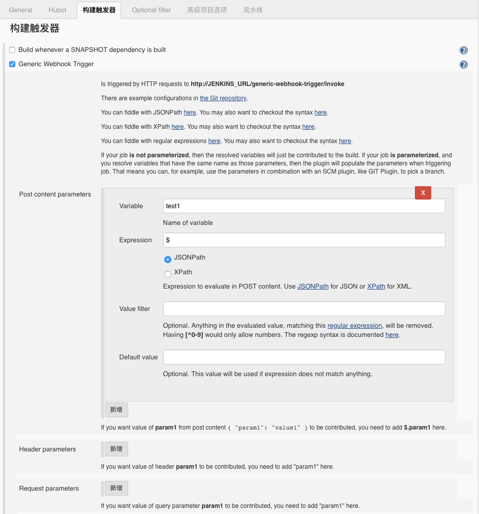
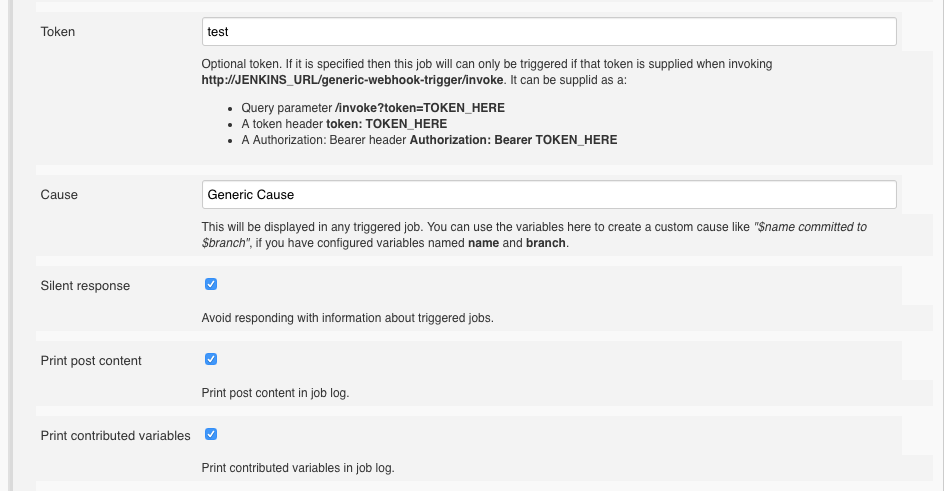
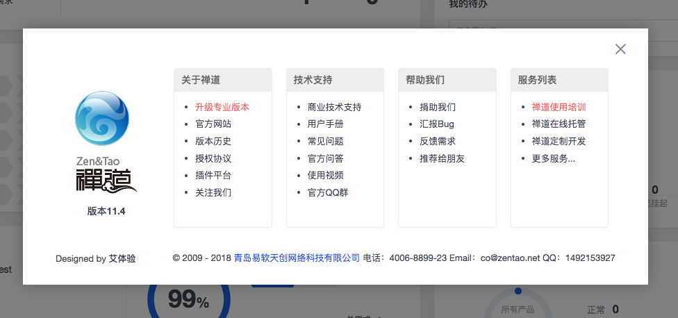
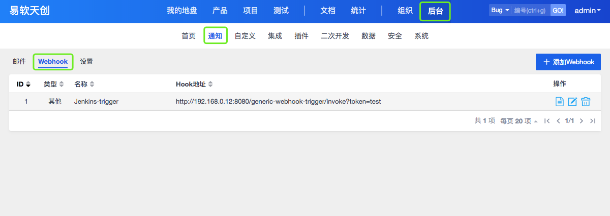
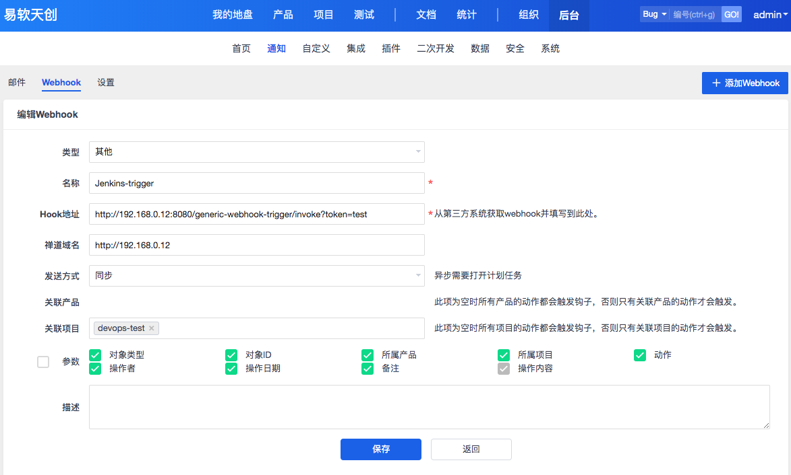
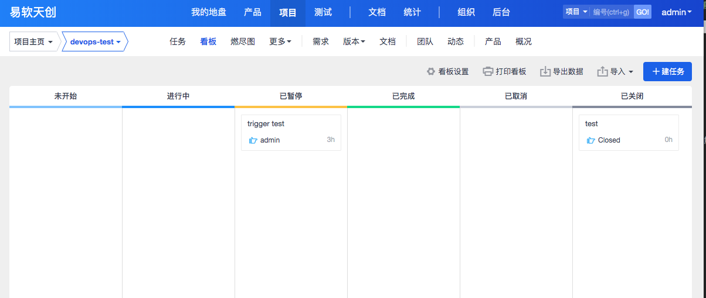
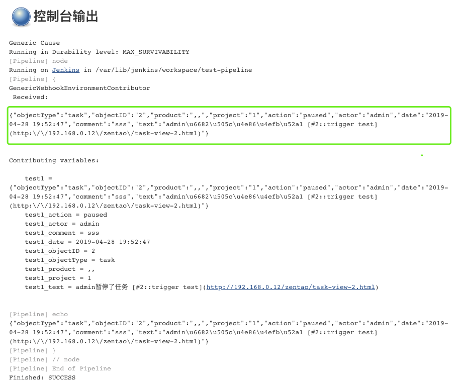

{}
您好，本章我们主要讲述Jenkins+jmeter自动化接口测试。
{}

### 总体目标
在禅道中，看板上的任务完成或者切换到某个指定的状态，触发Jenkins构建。

### Jenkins配置
#### 设置项目参数化构建

### 禅道系统配置
#### 禅道系统版本

#### 添加webhook

#### 配置webhook

### 测试集成

#### 更改任务状态

#### Jenkins日志

### 总结
- 在具体的实践中可以通过上图jenkins获取的参数进行逻辑判断，限制指定的状态构建。