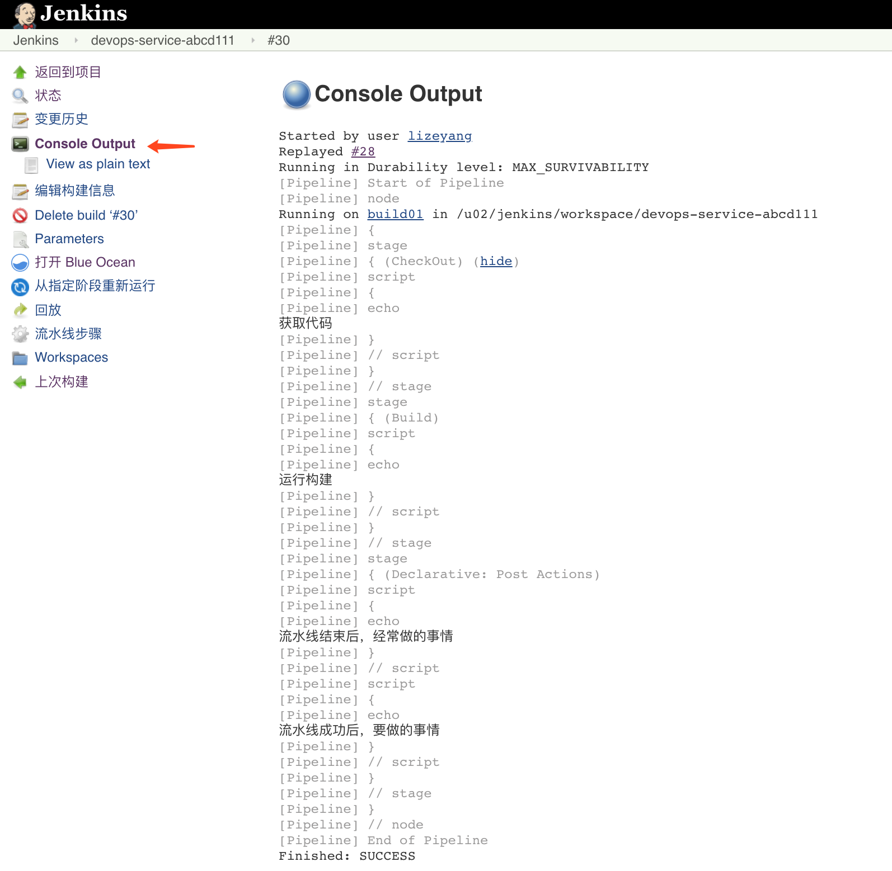
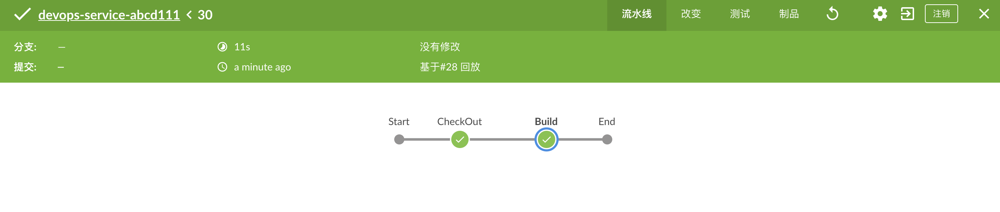

{}
您好，还在疑惑什么是流水线吗？ 本章我们将告诉您如何运行一条流水线 赶快学习吧！ 😀
{}

### 目录

+ [为什么使用pipeline?](#为什么使用pipeline?)
+ [pipeline定义](#pipeline定义)
+ [pipeline演示](#pipeline演示)
+ [验证流水线效果](#验证流水线效果)


---


### 为什么使用pipeline?

本质上，jenkins是一个自动化引擎，它支持许多自动模式。流水线向Jenkins添加了一组强大的工具，支持用例、简单的持续集成到全面的持续交付流水线。 通过对一系列的发布任务建立标准的模板，用户可以利用更多流水线的特性，比如：

* 代码化: 流水线是在代码中实现的，通常会存放到源代码控制，使团队具有编辑、审查和更新他们项目的交付流水线的能力。

* 耐用性：流水线可以从Jenkins的master节点重启后继续运行。
* 可暂停的：流水线可以由人功输入或批准继续执行流水线。
* 解决复杂发布： 支持复杂的交付流程。例如循环、并行执行。
* 可扩展性： 支持扩展DSL和其他插件集成。

构建一个可扩展是Jenkins的核心价值，流水线可以通过ShareLibrary的方式来扩展。

### pipeline定义

关于Jenkins流水线的运行我们可以抽象一下，例如：可以把流水线(pipeline)想象成13号线地铁，把流水线的阶段(stage)想象成地铁的每一个站点，把流水线脚本(jenkinsfile)想象成地铁线路图。这就是流水线的多样性，每条线路都有不同的站点。


现在地铁（Jenkins）已经有了，我们需要设计地铁的运行线路图（Jenkinsfile），在线路图中指定要经过的站点（stages）。这下你是否已经知道我们要运行一条流水线，需要先做什么呢？ --编写jenkinsfile 


Pipeline

* Jenkins的Pipeline通过Jenkinsfile进行描述（类似于Dockerfile）
* Jenkinsfile是Jenkins的特性（pipeline as code）
* Pipeline是Jenkins的核心功能，提供一组可扩展的工具。
* 通过Pipeline 的DSL语法可以完成从简单到复杂的交付流水线实现。

Jenkinsfile

* Jenkinsfile使用两种语法进行编写，分别是声明式和脚本式。
* 声明式和脚本式的流水线从根本上是不同的。
* 声明式是jenkins流水线更友好的特性。
* 脚本式的流水线语法，提供更丰富的语法特性。
* 声明式流水线使编写和读取流水线代码更容易设计。


### pipeline演示
来我们一起看下这里的配置，看下Jenkinsfile的组成及每个部分的功能含义。

* 使用agent{}，指定node节点/workspace（定义好此流水线在某节点运行）
* 指定options{}运行选项（定义好此流水线运行时的一些选项，例如输出日志的时间）
* 指定stages{}（stages包含多个stage，stage包含steps。是流水线的每个步骤)
* 指定post{}（定义好此流水线运行成功或者失败后，根据状态做一些任务）


```groovy
pipeline{
    //指定运行此流水线的节点
    agent { node { label "build"}}
    

    //流水线的阶段
    stages{

        //阶段1 获取代码
        stage("CheckOut"){
            steps{
                script{
                    println("获取代码")
                }
            }
        }
        stage("Build"){
            steps{
                script{
                    println("运行构建")
                }
            }
        }
    }
    post {
        always{
            script{
                println("流水线结束后，经常做的事情")
            }
        }
        
        success{
            script{
                println("流水线成功后，要做的事情")
            }
        
        }
        failure{
            script{
                println("流水线失败后，要做的事情")
            }
        }
        
        aborted{
            script{
                println("流水线取消后，要做的事情")
            }
        
        }
    }
}
```


### 验证流水线效果


查看Jenkins构建日志（正确效果）


通过BlueOcean查看（如果没有BlueOcean图标，需要自行在插件中心安装插件）



到此一个简单的Jenkinfile完成了！ 后面我们来详细分析每个步骤的作用。

---


