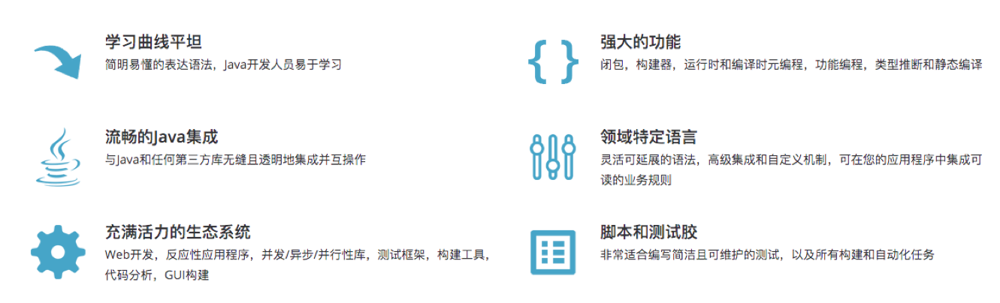
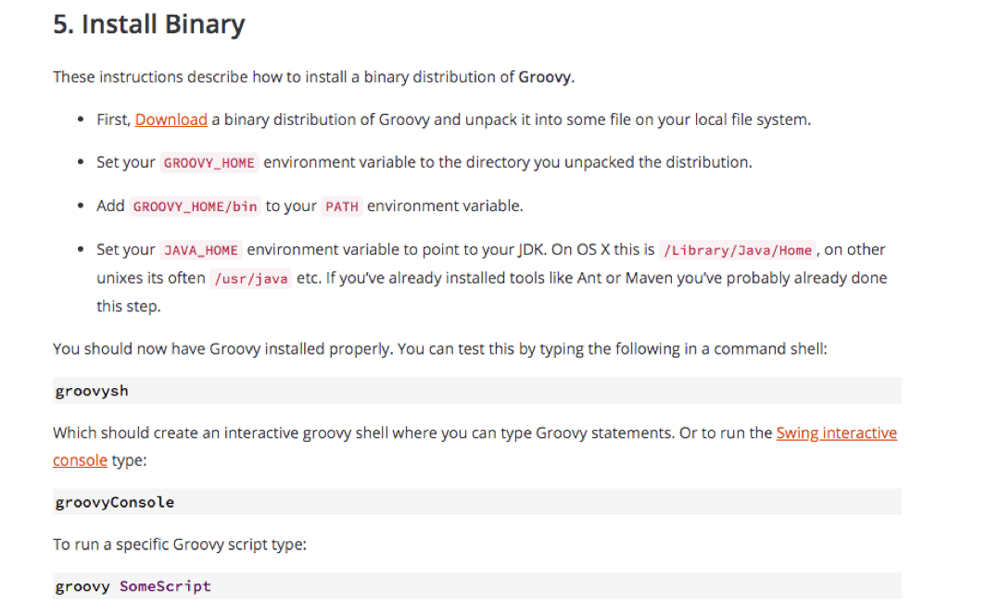

{}
您好，本模块主要学习Groovy基础语法，掌握基础语法便于在流水线中数据处理😀
{}

### 目录

+ [简介](#简介)
+ [安装](#安装)
+ [数据类型](#数据类型)
  - [字符串string](#字符串string)
  - [列表list](#列表list)
  - [映射map](#映射map)
+ [条件语句](#条件语句)
  - [if语句](#if语句)
  - [switch语句](#switch语句)
+ [循环语句](#循环语句)
  - [for循环语句](#for循环语句)
  - [while循环语句](#while循环语句)
+ [函数](#函数)

---

### 简介

Groovy是一种功能强大，可选类型和动态 语言，支持Java平台。旨在提高开发人员的生产力得益于简洁，熟悉且简单易学的语法。可以与任何Java程序顺利集成，并立即为您的应用程序提供强大的功能，包括脚本编写功能，特定领域语言编写，运行时和编译时元编程以及函数式编程。





### 安装

* 下载安装包(先安装JDK)
* 解压安装包 获取安装包bin目录
* 写入/etc/profile文件

```
export GROOVY_HOME=xxx
export PATH=$PATH:$GROOVY_HOME/bin

source /etc/profile
```




### 数据类型


#### 字符串string
字符串表示： 单引号、双引号、三引号

```
contains() 是否包含特定内容  返回true false
size() length() 字符串数量大小长度
toString() 转换成string类型
indexOf() 元素的索引
endsWith()  是否指定字符结尾
minus() plus()  去掉、增加字符串
reverse()  反向排序
substring(1,2) 字符串的指定索引开始的子字符串
toUpperCase() toLowerCase()  字符串大小写转换
split() 字符串分割 默认空格分割  返回列表
```

#### 列表list

列表的表示： []   [1,2,3,4]
```
+ - += -= 元素增加减少
isEmpty() 判断add()  << 添加元素
是否为空
intersect([2,3]) disjoint([1])  取交集、判断是否有交集
flatten() 合并嵌套的列表
unique() 去重
reverse() sort()  反转 升序
count() 元素个数
join() 将元素按照参数链接
sum() min() max() 求和 最小值 最大值
contains() 包含特定元素
remove(2) removeAll()
each{}  遍历
```

#### 映射map

types = ["maven":"mvn"]

```
size() map大小
[’key’]  .key get()  获取value
isEmpty() 是否为空
containKey() 是否包含key
containValue() 是否包含指定的value
keySet() 生成key的列表
each{} 遍历map
remove(‘a‘)  删除元素（k-v）

练习

groovy:000> [:]
===> [:]
groovy:000> [1:2]
===> [1:2]
groovy:000> [1:2][1]
===> 2
groovy:000> [1:2,3:4,5:6]
===> [1:2, 3:4, 5:6]
groovy:000> [1:2,3:4,5:6].keySet()
===> [1, 3, 5]
groovy:000> [1:2,3:4,5:6].values()
===> [2, 4, 6]
groovy:000> [1:2,3:4,5:6] + [7:8]
===> [1:2, 3:4, 5:6, 7:8]
groovy:000> [1:2,3:4,5:6] - [7:8]
===> [1:2, 3:4, 5:6]
```


### 条件语句

#### if语句
在Jenkinsfile中可用于条件判断。

```
if (表达式) {
   //xxxx
} else if(表达式2) {
   //xxxxx
} else {
   //
}

练习
groovy:000> buildType = "maven"
===> maven
groovy:000> if (buildType == "maven"){
groovy:001>     println("This is a maven project!")
groovy:002> } else if (buildType == "gradle"){
groovy:003>    println("This is a gradle project!")
groovy:004> } else {
groovy:005>    println("Project Type Error!")
groovy:006> }
```


#### switch语句

```
switch("${buildType}"){
    case ”maven":
    //xxxx
        break;
    case ”ant":
    //xxxx
        break;
    default:
    //xxxx
}

练习
switch("${buildType}"){
    case 'maven':
        println("This is a maven project !")
        break;
        ;;

    case 'gradle':
        println("This is a gradle projects!")
        break;
        ;;

    default:
        println("Project Type Error!")
        ;;
}

```


### 循环语句

#### for循环语句

```
test = [1,2,3]
for ( i in test){
    ///xxxxxx
    break;
}

//代码
langs = ['java','python','groovy']

for ( lang in langs ){
    if (lang == "java"){
        println("lang error in java")
    }else {
        println("lang is ${lang}")
    }
}
```


#### while循环语句

```
while(true){
    //xxxx
}
```


### 函数

在共享库中每个类中的方法。
```
def PrintMes(info){
    println(info)
    return info
}

response = PrintMes("DevOps")
println(response)
```

---


