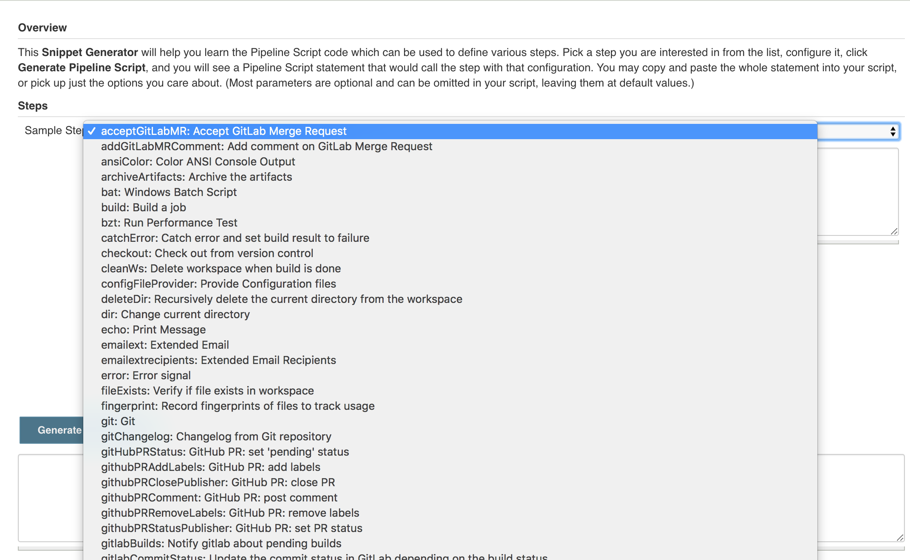
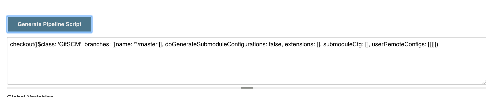
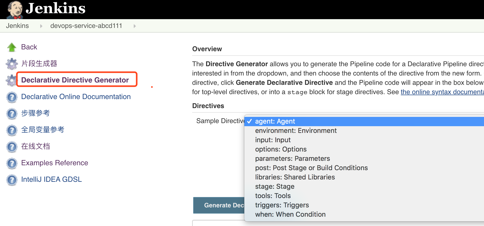
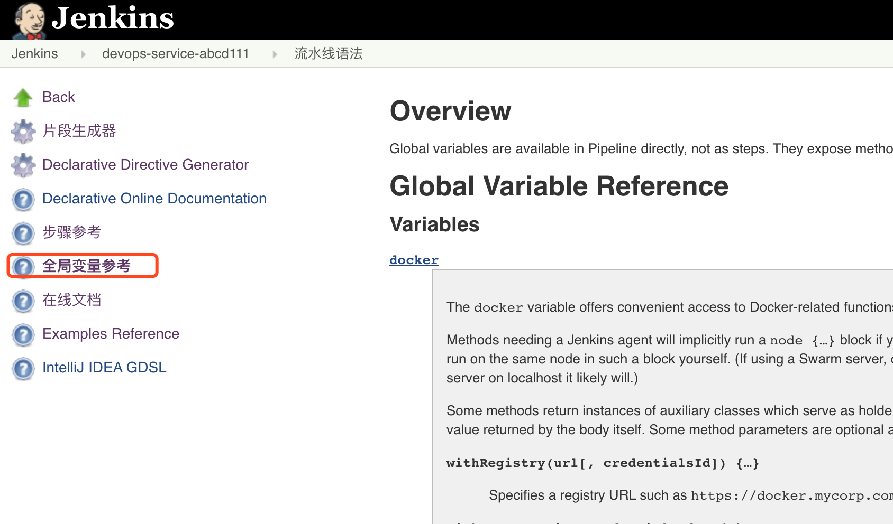

{}
您好，本模块主要了解在流水线中常用的方法😀
{}

### 目录

+ [片段生成器](#片段生成器)
+ [声明式语法生成器](#声明式语法生成器)
+ [全局变量参考](#全局变量参考)
  - [env变量](#env变量)
  - [currentbuild变量](#currentbuild变量)
+ [常用的方法](#常用的方法)

---


### 片段生成器

使用片段生成器可以根据个人需要生成方法，有些方法来源于插件，则需要先安装相关的插件才能使用哦。




填写好参数后，点击生成，然后复制粘贴到Jenkinsfile



### 声明式语法生成器




### 全局变量参考



#### env变量

```
BUILD_NUMBER          //构建号
BUILD_ID              //构建号
BUILD_DISPLAY_NAME    //构建显示名称
JOB_NAME              //项目名称
              
EXECUTOR_NUMBER       //执行器数量
NODE_NAME             //构建节点名称
WORKSPACE             //工作目录
JENKINS_HOME          //Jenkins home
JENKINS_URL           //Jenkins地址
BUILD_URL             //构建地址
JOB_URL               //项目地址
```

#### currentbuild变量

```
result  currentResult   //构建结果
displayName      //构建名称  #111
description      //构建描述
duration         //持续时间
```


### 常用的方法

**json数据处理**

```
def response = readJSON text: "${scanResult}"
println(scanResult)

//原生方法
import groovy.json.*

@NonCPS
def GetJson(text){
    def prettyJson = JsonOutput.prettyPrint(text) 
    new JsonSlurperClassic().parseText(prettyJson)
}

```


**使用凭据**

```
withCredentials([string(credentialsId: "xxxxx", variable: "sonarToken")]) {
    println(sonarToken)
}
```

下载代码

```
//Git
checkout([$class: 'GitSCM', branches: [[name: "brnachName"]], 
            doGenerateSubmoduleConfigurations: false, 
            extensions: [], submoduleCfg: [], 
            userRemoteConfigs: [[credentialsId: "${credentialsId}", 
            url: "${srcUrl}"]]])
//Svn
checkout([$class: 'SubversionSCM', additionalCredentials: [], 
            filterChangelog: false, ignoreDirPropChanges: false, 
            locations: [[credentialsId: "${credentialsId}", 
            depthOption: 'infinity', ignoreExternalsOption: true, 
            remote: "${svnUrl}"]], workspaceUpdater: [$class: 'CheckoutUpdater']]
)
```

展示报告

```
publishHTML([allowMissing: false, 
        alwaysLinkToLastBuild: false, 
        keepAll: true, 
        reportDir: './report/', 
        reportFiles: "a.html, b.html", 
        reportName: 'InterfaceTestReport', 
        reportTitles: 'HTML'])

```


交互输入

```
def result = input  message: '选择xxxxx', 
                    ok: '提交',
                    parameters: [extendedChoice( description: 'xxxxx', 
                                                descriptionPropertyValue: '', 
                                                multiSelectDelimiter: ',', 
                                                name: 'failePositiveCases', 
                                                quoteValue: false, 
                                                saveJSONParameterToFile: false, 
                                                type: 'PT_CHECKBOX', 
                                                value: "1,2,3", 
                                                visibleItemCount: 99)]   
println(result)
```


构建用户

```
wrap([$class: 'BuildUser']){
            echo "full name is $BUILD_USER"
            echo "user id is $BUILD_USER_ID"
            echo "user email is $BUILD_USER_EMAIL"
}
```

制品上传

```
rtUpload (
        serverId: "artifactory01",
        spec:
            """{
            "files": [
                {
                "pattern": "report/a.html",
                "target": "${repoName}/a/b/v"
                }
            ]
            }"""
    )
```


发送http请求

```
ApiUrl = "http://xxxxxx/api/project_branches/list?project=${projectName}"
Result = httpRequest authentication: 'xxxxxxxxx',
                         quiet: true, 
                         contentType: 'APPLICATION_JSON' ,  
                         url: "${ApiUrl}"
```


---


