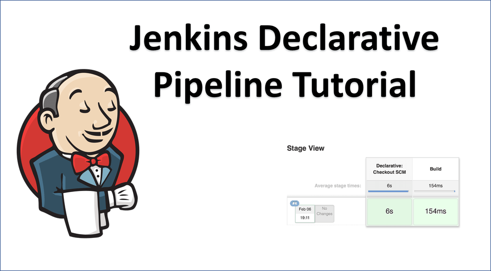

Jenkins 为您提供了两种开发流水线代码的方式：脚本式和声明式。 

脚本式流水线（也称为“传统”流水线）基于 Groovy 作为其特定于域的语言。 而声明式流水线提供了简化且更友好的语法，并带有用于定义它们的特定语句，而无需学习 Groovy。

Jenkins 的流水线插件版本2.5引入了对声明式流水线的支持。 

在本文中，我们将介绍开发声明式流水线脚本的所有可用指令，这将清楚地说明其功能。


##  声明式流水线语法

必须使用 `pipeline` 语句定义有效的声明式流水线，并包括以下必需的部分：

- agent
- stages
- stage
- steps

另外，还有这些可用的指令：

- environment (在流水线或阶段级别定义)
- input (阶段级别定义)
- options (在流水线或阶段级别定义)
- parallel
- parameters
- post
- script
- tools
- triggers
- when

现在，我们将从所需的指令/部分开始，对列出的每个指令/部分进行描述。

### agent

Jenkins 通过将分布式构建委托给“代理/agent”节点来提供执行分布式构建的能力。
这样做可以使您仅使用 Jenkins 服务器的一个实例来执行多个项目，而工作负载却被分配给了它的代理。
有关如何配置主/代理模式的详细信息超出了本博客的范围。请参阅 Jenkins 分布式构建以获取更多信息。

代理应标记上标签，以便彼此轻松识别。 例如，节点可以通过其平台（Linux，Windows 等），其版本或位置等来标记。 “agent”部分配置流水线可以在哪些节点上运行。
指定 `agent any` 意味着 Jenkins 将在任何可用节点上运行任务。

其用法的一个示例可以是：

```
pipeline {
    agent any
...
}
```

### stages

本部分允许在流水线上生成不同的阶段，这些阶段将在运行任务时显示为不同的段。

一个包含阶段语句的示例流水线：

```
pipeline {
    agent any
    stages {
        ...
    }
}
```

### stage

必须在“stages”部分上定义至少一个“stage”部分。 它将包含流水线将执行的工作。 阶段必须命名，因为 Jenkins 将在界面上显示每个阶段，如下所示：


Jenkins 根据定义的阶段以图形方式拆分流水线执行，并显示它们的持续时间以及是否成功。

上一个图像的流水线脚本如下所示：

```
pipeline {
    agent any
    stages {
        stage ('build') {
            ...
        }
        stage ('test: integration-&-quality') {
            ...
        }
        stage ('test: functional') {
            ...
        }
        stage ('test: load-&-security') {
            ...
        }
        stage ('approval') {
            ...
        }
        stage ('deploy:prod') {
            ...
        }
    }
}
```

### steps

最后一个必需的部分是“steps”，它被定义为在“stage”内。 在“steps”部分中必须至少定义一个步骤。

对于 Linux 和 MacOS，支持使用 shell。 这是一个例子：

```groovy
steps {
    sh 'echo "A one line step"'
    sh ''' 
    echo "A multiline step"'
    cd /tests/results
    ls -lrt
    '''
}
```

对于 Windows，可以使用 bat 或 PowerShell，如下所示：

```groovy
steps {  
    bat "mvn clean test -Dsuite=SMOKE_TEST -Denvironment=QA"
    powershell ".\funcional_tests.ps1"
}
```

其他非必需的指令将在以下段落中说明。

### environment

可以在阶段或流水线级别定义此指令，这将决定其定义的范围。在“pipeline”级别使用“environment”时，其定义将对所有流水线步骤均有效。
相反，如果它是在“stage”中定义的，则它仅对特定阶段有效。

该指令的示例用法：

在“pipeline”级别：

```
pipeline {
    agent any
    environment {
        OUTPUT_PATH = './outputs/'
    }
    stages {
        stage ('build') {
        ...
    }
    ...
    }
}
```

在"stage"级别：

```
pipeline {
    agent any
    stages {
        stage ('build') {
            environment {
                OUTPUT_PATH = './outputs/'
            }
            ...
        }
        ...
    }
}
```

### input

“input”指令在阶段级别定义，提供提示输入的功能。该阶段将被暂停，直到用户手动确认为止。

以下配置选项可用于此指令：

- message：这是必需的选项，其中指定了要显示给用户的消息。
- id：可选标识符。 默认情况下，使用“阶段”名称。
- ok：“确定”按钮的可选文本。
- submitter：允许提交输入的用户或外部组名的可选列表。 默认情况下，允许任何用户。
- submitterParameter：要使用提交者名称设置的环境变量的可选名称（如果存在）。
- parameters：提交者将提供的可选参数列表。

这是包含此指令的示例流水线：

```groovy
pipeline {
    agent any
    stages {
        stage ('build') {
            input{
               message "Press Ok to continue"
               submitter "user1,user2"
                parameters {
                   string(name:'username', defaultValue: 'user', description: 'Username of the user pressing Ok')
                }
            }
            steps { 
                echo "User: ${username} said Ok."
            }
        }
    }
}
```

### options

在流水线级别定义，此指令将对整个流水线的特定选项进行分组。可用的选项有：

- buildDiscarder 
- disableConcurrentBuilds 
- overrideIndexTriggers 
- skipDefaultCheckout 
- skipStagesAfterUnstable 
- checkoutToSubdirectory 
- newContainerPerStage 
- timeout 
- retry 
- timestamps 

请参阅 Jenkins 声明式流水线选项，以获取有关此内容的完整参考。

例如，您可以通过以下操作将流水线配置为在失败前重试3次：

```groovy
pipeline {
    agent any
    options {
        retry(3)
    }
    stages {
        echo 'do something'
    }
}
```

### parallel

Jenkins 流水线阶段可以在内部嵌套其他阶段，这些阶段将并行执行。

这是通过在脚本中添加“parallel”指令来完成的。 使用示例：

```groovy
stage('run-parallel-branches') {
    steps {
        parallel(
            a: {
                echo "Tests on Linux"
            },
            b: {
                echo "Tests on Windows"
            }
        )
    }
}
```

从声明式流水线1.2版开始，引入了一种新语法，使并行语法的使用更像声明式的。

使用此新语法重写的先前脚本如下所示：

```groovy
pipeline {
    agent none
    stages {
        stage('Run Tests') {
            parallel {
                stage('Test On Windows') {
                    agent {
                        label "windows"
                    }
                steps {
                    bat "run-tests.bat"
                }
                }
                stage('Test On Linux') {
                    agent {
                        label "linux"
                    }
                    steps {
                        sh "run-tests.sh"
                    }
                }
            }
        }
    }
}
```

上述的任何一个流水线都将如下所示：


由于两个脚本都运行特定的平台测试，因此它们将在不同的节点上运行测试。 如果您的 Jenkins 服务器具有足够的 CPU，则还可以通过使用多线程将并行用于在同一节点上同时运行阶段。

使用并行阶段时有一些限制：

- stage 指令可以具有 parallel 指令或 steps 指令，但不能同时具有两者。
- parallel 指令中的一个 stage 指令不能嵌套另一个 parallel 指令，仅允许 steps。
- 在内部具有 parallel 指令的 stage 指令不能定义“agent”或“tools”指令。

### parameters

该指令允许您定义脚本中要使用的参数列表。一旦触发流水线，应提供参数。应该在“pipeline”级别定义它，并且整个流水线只允许一个指令。

字符串和布尔值是可以使用的有效参数类型。

```groovy
pipeline {
    agent any
    parameters {
        string(name: 'user', defaultValue: 'John', description: 'A user that triggers the pipeline')
    }
    stages {
        stage('Trigger pipeline') {
            steps {
                echo "Pipeline triggered by ${params.USER}"
            }
        }
    }
}
```

### post

可以在流水线级别或每个阶段上添加 post，一旦阶段或流水线完成，便会执行其中包含的语句。可以使用几个 post 条件来控制是否执行该 post：

- always：无论完成状态如何，都会执行步骤。
- changed：仅当完成结果与上次运行的状态不同时才执行。
- fixed：仅在完成结果是成功且上次运行失败时执行
- regression：仅在当前执行失败，中止或不稳定并且上一次运行成功时执行。
- aborted：仅在流水线或阶段中止时才执行步骤。
- failure：仅在流水线或阶段失败时才执行步骤。
- success：仅在流水线或阶段成功时才执行步骤。
- unstable：仅当流水线或阶段不稳定时才执行步骤。

由于流水线 post 包含的句子将在脚本的末尾运行，因此可以在此处执行清除任务或通知等。

```groovy
pipeline {
    agent any
    stages {
        stage('Some steps') {
            steps {
                echo 'do something'
            }
        }
    }
    post {
        always {
            echo "Pipeline finished"
            bat './performCleanUp.bat'
        }
    }
}
```

### script

此步骤用于将脚本化流水线语句添加到声明式流水线中，从而提供更多功能。此步骤必须包括在“stage”级别。

脚本块可以多次用于不同的项目。这些块使您可以扩展 Jenkins 功能，并可以实现为共享库。可以在 Jenkins 共享库中找到有关此内容的更多信息。
同样，可以将共享库导入并使用到“script”中，从而扩展了流水线功能。

接下来，我们将提供示例流水线。第一个只有一个包含一段脚本化流水线代码的块，而第二个将展示如何导入和使用共享库：

```groovy
pipeline {
    agent any
    stages {
        stage('Sample') {
            steps {
                echo "Scripted block"
                script {

                }
            }
        }
    }
}
```

有关此主题的更多信息，请参阅如何使用 Jenkins 脚本式流水线的文章。

### tools

可以在流水线级别或阶段级别添加“tools”指令。 它允许您指定要在脚本上使用的 Maven，JDK 或 Gradle 版本。 必须在“全局工具配置” Jenkins 菜单上配置这些工具中的任何一个，在撰写本文时，这三个工具都受支持。

另外，Jenkins 将尝试安装列出的工具（如果尚未安装）。通过使用此指令，可以确保安装了项目所需的特定版本。

```groovy
pipeline {
    agent any
    tools {
        maven 'apache-maven-3.0.1'
    }
    stages {
         echo 'do something'
    }
}
```

### triggers

触发器允许 Jenkins 通过使用以下任何一个可用的方式自动触发流水线：

- cron：通过使用 cron 语法，它可以定义何时重新触发流水线。
- pollSCM：通过使用 cron 语法，它允许您定义 Jenkins 何时检查新的源存储库更新。如果检测到更改，则将重新触发流水线。（从 Jenkins 2.22 开始可用）。
- upstream：将 Jenkins 任务和阈值条件作为输入。 当列表中的任何任务符合阈值条件时，将触发流水线。

带有可用触发器的示例流水线如下所示：

```
pipeline {
    agent any
    triggers {
        //Execute weekdays every four hours starting at minute 0
        cron('0 */4 * * 1-5')
    }
    stages {
        ...
    }
}


pipeline {
    agent any
    triggers {
        //Query repository weekdays every four hours starting at minute 0
        pollSCM('0 */4 * * 1-5')
    }
    stages {
        ...
    }
}


pipeline {
    agent any
    triggers {
        //Execute when either job1 or job2 are successful
        upstream(upstreamProjects: 'job1, job2', threshold: hudson.model.Result.SUCCESS)
    }
    stages {
        ...
    }
}
```

### when

可以根据“when”指令中定义的条件执行流水线步骤。如果条件匹配，将运行相应阶段中定义的步骤。它应该在阶段级别定义。

有关条件及其说明的完整列表，请参阅 Jenkins 声明式流水线“when”指令。

例如，流水线使您可以在具有多个分支的项目上执行任务。这被称为多分支流水线，其中可以根据分支名称（例如“master”，“ feature*”，“development”等）采取特定的操作。
这是一个示例流水线，它将运行 master 分支的步骤：

```groovy
pipeline {
    agent any
    stages {
        stage('Deploy stage') {
            when {
                branch 'master'
            }
            steps {
                echo 'Deploy master to stage'
            }
        }
    }
}
```

## 最后2个 Jenkins 声明式流水线提示

声明式流水线语法错误在脚本开始时报告。 这是一个很好的功能，因为您不会浪费时间，直到某个步骤未能意识到拼写错误或拼写错误。

如前所述，流水线可以以声明式或脚本式编写。而且，声明式方法建立在脚本式方法的基础之上，通过添加"script"步骤，可以很容易地进行扩展。

Jenkins 流水线已在 CI/CD 环境中广泛使用。不管是使用声明式或脚本式流水线都具有多个优点。在本文中，我们介绍了编写示例脚本展示声明式流水线的所有语法元素。
就像我们已经说过的那样，声明式提供了更加友好的语法，而无需 Groovy 知识。