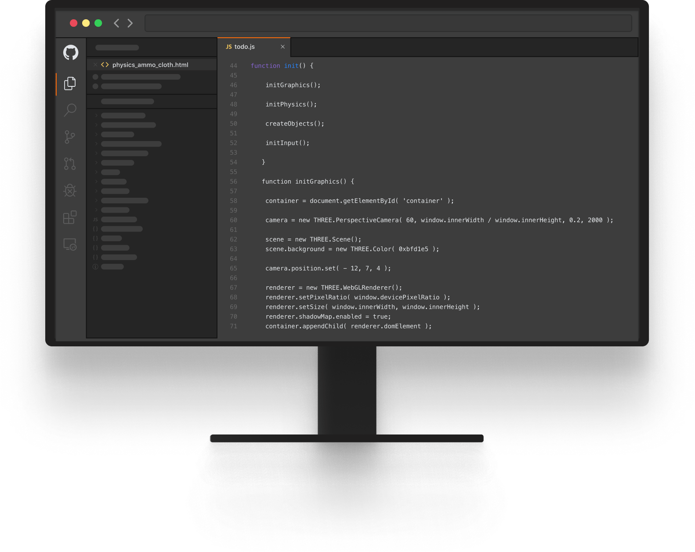
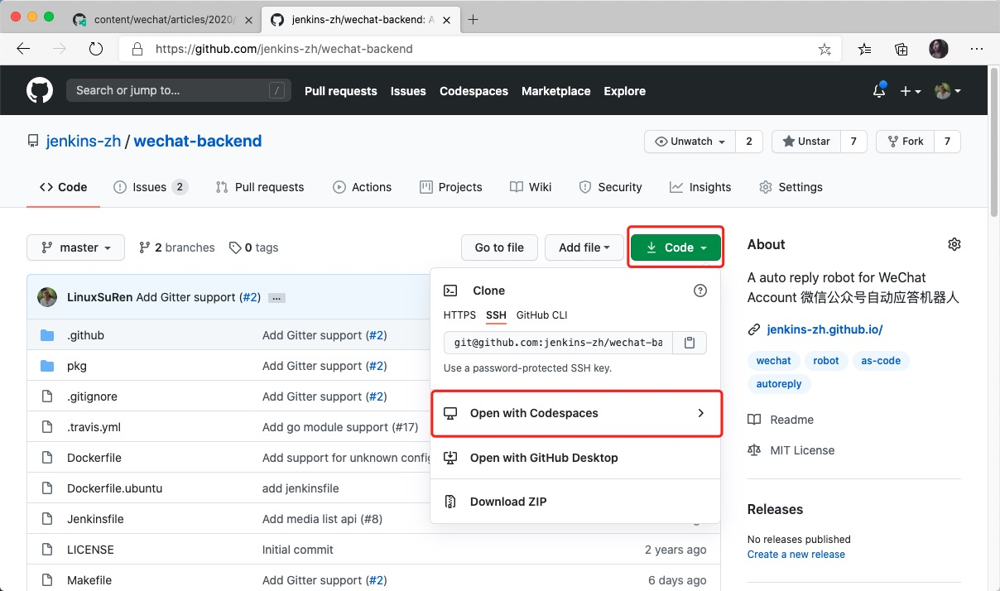
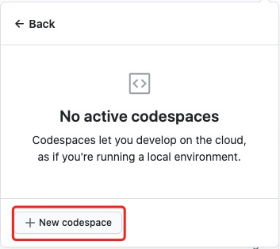
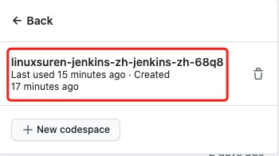
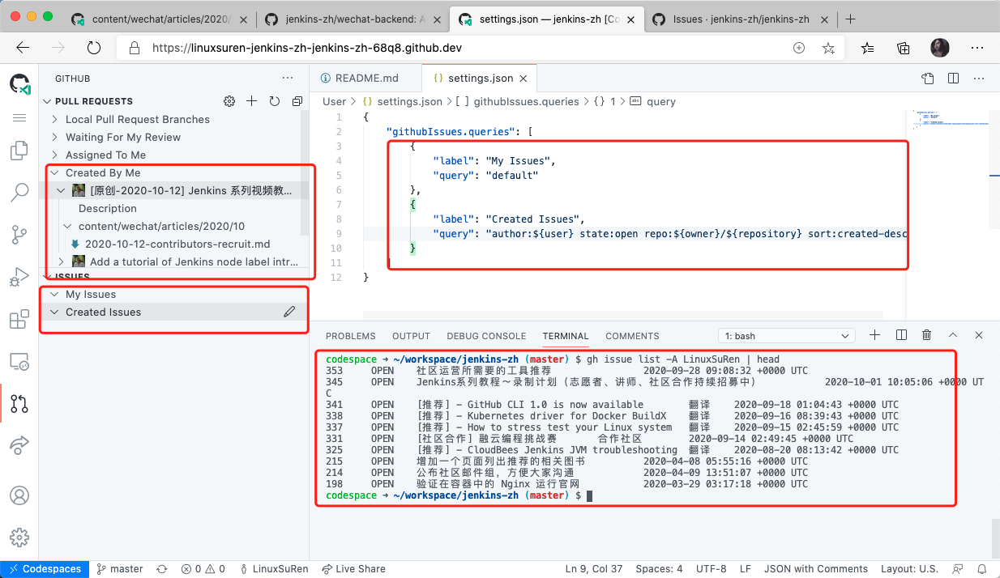
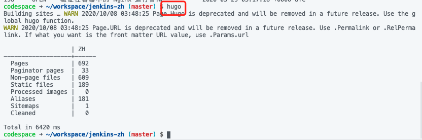
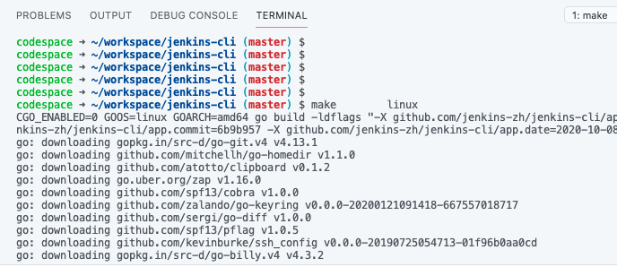
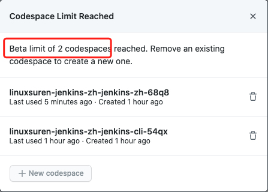
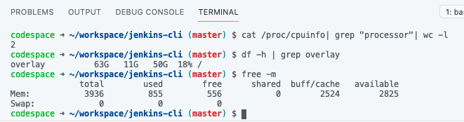

这是国庆假期最后一天的早晨，浏览完几份未读的邮件之后，顺手打开 GitHub 看看有没有啥新动态。欣喜地发现 GitHub 又给我们放出来了
一个功能 Codespaces，特地和大家来分享。

关注开源的朋友们，一定都知道国内的代码托管平台 Gitee 在早些时候提供了 WebIDE 的功能，这确实是一个很贴心的举动。当我们希望在线
编辑一些稍微复杂点的文件时，普通的文本框就显得没有那么好用。例如：大量的开源项目文档采用的 Markdown 格式来编写，普通的文本框
就无法提供预览效果。WebIDE 则不同，它可以给我们提供接近本地 IDE 的使用体验，例如：语法高亮、多文件编辑等等。

但是，Gitee 给我们提供的 WebIDE 并不完整，编辑文件只是最基础的功能，对开发者而言没有控制台的 IDE 是没有灵魂的。当时，能猜想到
GitHub 作为全球最大的代码托管平台，肯定是会提供类似的功能。那么，今天大家终于等到了。下面，给大家分享下我在使用 Codespaces 时
的一些体验。

首先，编辑器的入口是非常重要的一点。GitHub 选择 Code 作为入口，也是非常恰当的；虽然，我一开始感觉有点找不到北。 Code -> Open with Codespaces

第一次使用的话，会提示你新建一个 codespace

如果是再次进入 codespace 的话，就可以选择一个已经创建好的

真正让我感到眼前一亮的功能在于它集成了对 PullRequest 和终端控制台的支持，这两点对于一个开源项目的贡献者来说是非常需要的功能。

从下面的图中可以看到，我们可以非常便捷地找到由本人创建的或者所有的 PR，还可以看到 PR 所修改了的文件列表。甚至，项目维护者都可以直接给 PR 添加评论或者 approve。

有点美中不足的是，issues 功能貌似是有点缺陷，无法看到正确的列表。

更强大的地方在于，我们在 Codespace 的终端可以直接执行一些命令。例如：在上图中，我可以通过 GitHub 官方的 CLI 来查看 PR 或者 issues 等。我们无需为 gh 配置凭据信息，Codespace 已经提供了开箱即用的体验。

对于 Hugo 这种静态网站的项目，也是可以直接执行 hugo 命令的：

对于 Golang 的项目，同样支持编译、单元测试等命令的执行。

想必要支持编译环境的话，需要消耗较多的计算资源，因此，GitHub 提供 Beta 级别的 Codespace 只允许我们创建两个工作空间。

再让我们来看看 Codespace 给大家提供的环境配置：4G内存、2核CPU、60G磁盘。对于中小型的开源项目而言，完全可以满足要求了。

除了 gh、hugo、git、go 等命令外，还集成了如下的命令行工具：

* docker 19.03.12+azure
* kubectl v1.19.2
* helm v3.3.4
* java OpenJDK 11.0.8
* python 2.7.13
* maven 5.4.0-1026-azure
