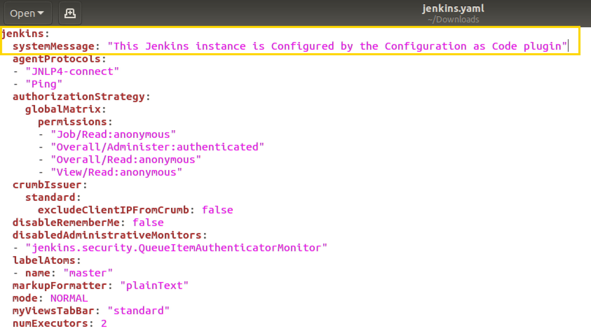
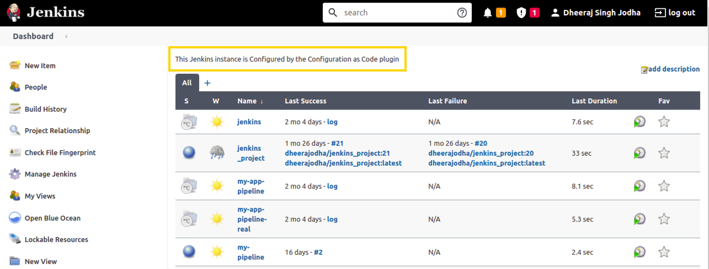
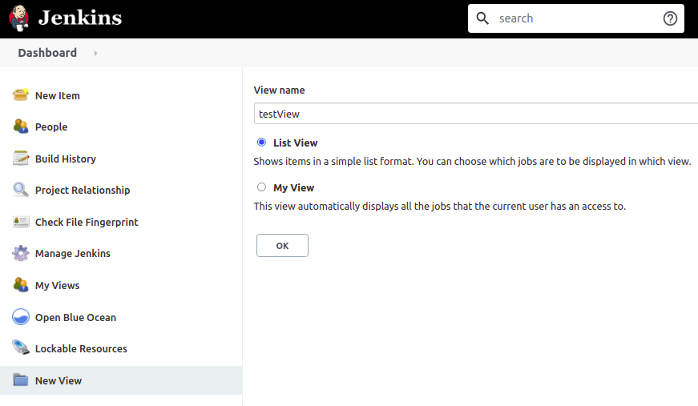
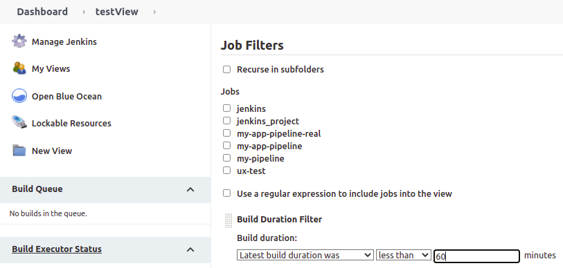
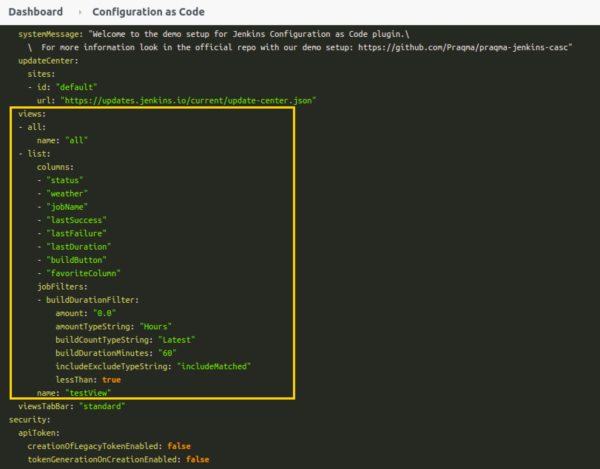
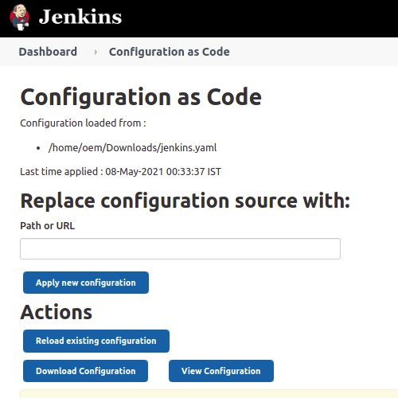
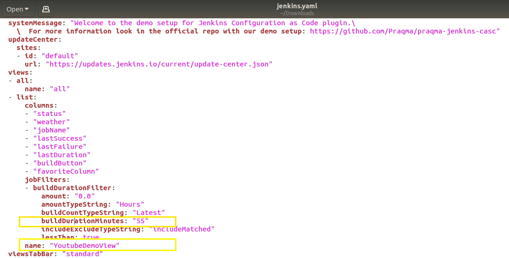
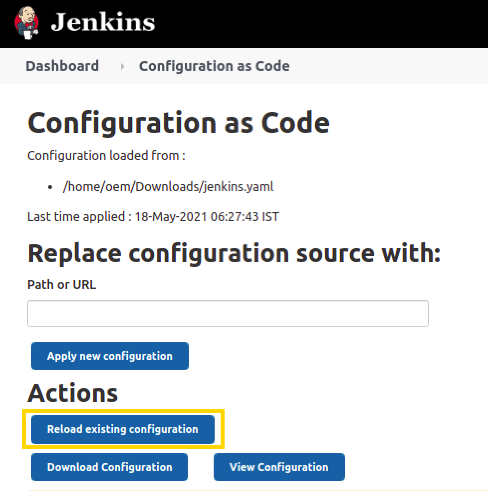
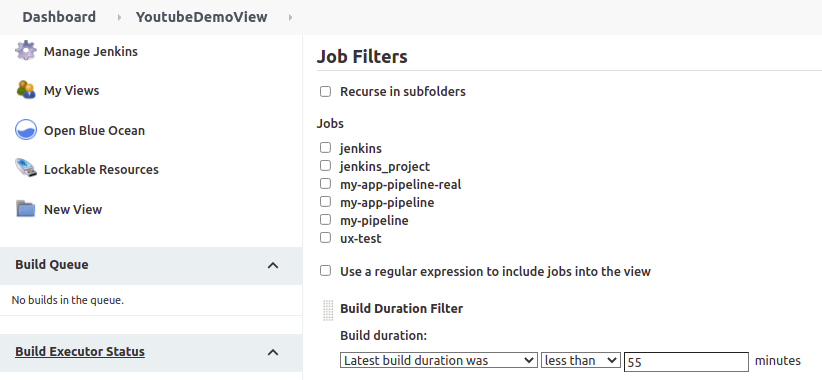

# 用 JCasC 配置插件

这个博客是写给任何对用 Jenkins 的 JCasC 配置插件感兴趣的人，具体会讲解如何获得 YAML 格式的配置信息和如何在不通过 Jenkins 的图形界面的情况下更改插件的信息。

如果你是 JCasC 的新手并且想了解关于 JCasC 更多的内容，你可以先去看下列链接中的内容，来更好的理解 JCasC。

- [JCasC Documentation](https://plugins.jenkins.io/configuration-as-code/)
- [Overview of JCasC (Video Presentation)](https://www.youtube.com/watch?v=wTzljM-EDjI)
- [Manage JCasC (DevOps World 2018)](https://www.youtube.com/watch?v=47D3H1BZi4o)

## 概要

下面是大致的步骤：

1. 简要介绍 jenkins.yaml 文件
2. 在 Jenkins 的图形界面上配置插件
3. 下载配置文件
4. 本地更新 JCasC 文件
5. 在 Jenkins 服务器上加载 `jenkins.yaml` 文件
6. 在图形界面上验证

### 简要介绍 jenkins.yaml 文件

* `jenkins.yaml` 文件里有 Jenkins 实例的配置信息。 JCasC 插件用.yaml 文件来配置 Jenkins 实例。
* `jenkins.yaml` 文件的默认位置是在 `$JENKINS_HOME/jenkins.yaml`，Jenkins 服务器在你应用新的配置后会自动从这个位置读取配置文件。
* 按照以下步骤：`Manage Jenkins > Configuration as Code > Download Configuration`，下载你的 `jenkins.yaml` 文件。
* 要确保 `jenkins.yaml` 是在 `$JENKINS_HOME/jenkins.yaml` 这个路径里。
* 更改 `systemMessage` 的值为如下：

图1. 更新 jenkins.yaml 文件

* 重新加载现有的配置，让 systemMessage 生效。

* 现在，在工作台的顶端，你可以看到更新过后的 System Message

图2. 看工作台上的变化

* 之后我们会用这个文件通过 JCasC 来配置插件。

### 在 Jenkins 的图形界面上配置插件

* 为了完成这个例子，需要安装 `View Job Filters` 插件。
* 现在可以通过工作台上左侧的 `New View` 按钮创建一个 view。
* 给一个名字（例如：“testView”），把类型设置为 `List View`，然后按 `OK` 按钮。

图3. 创建 View

* 点击 `Add Job Filter` 添加过滤器（filter），让我们选择 `Build Duration Filter`，然后填写值（例如：“60” 分钟）

图4. 在 view 中添加过滤器

* 点击 `Apply > Save`
* 在你的主要的 `jenkins.yaml` 配置文件中能看到所有的配置信息。点击 `Manage Jenkins > Configuration as Code > View Configuration`可以查看 `jenkins.yaml` 文件。
* 在YAML文件中找到 `views` 部分，可以看到关于 view 的详细信息，

图5. 在这里可以看到关于 view（我们刚创建的）的详细信息

### 下载配置文件

* 现在你已经成功通过图形界面配置好插件了，让我们来到工作台上的 `Manage Jenkins`，点击 `System Configuration` 下的 `Configuration as Code` ，就可以下载配置文件。
* 现在点击 `Download Configuration` 将配置下载到本地。

图6. 下载配置

### 本地更新 JCasC 文件

* 在下载下来的 `jenkins.yaml` 文件里进行一些修改，并看看图形界面上自动产生的变化。
* 作为一个例子，让我们将配置文件里的 `name` 的对应值改成“YoutubeDemoView”并且将 `buildDurationMinutes` 值设为 55。

图7. 在本地修改关于 View 的信息

* 保存文件

### 在 Jenkins 服务器上加载 jenkins.yaml 文件

* 现在为了能让 `jenkins.yaml` 文件里的改变应用到 Jenkins 服务器上，点击 `Reload existing configuration` 按钮。

图8. 将新的配置应用到 Jenkins 实例中

### 在图形界面上验证

* 通过点击左上方的 Jenkins 图标回到主页面。
* 你会注意到你的 view 的名字从“testView”变成了“YoutubeDemoView”。
* 并且 `Build Duration Filter` 的值从“60”变成了“55”。
* 这两个变化就是我们刚刚在本地修改 `jenkins.yaml` 文件中的内容

图9. 验证变化

恭喜你! :smile:你已经成功在“Jenkins Configuration as Code” 插件的帮助下自动配置了插件！你现在可以重复刚刚的步骤来配置更多的插件。
